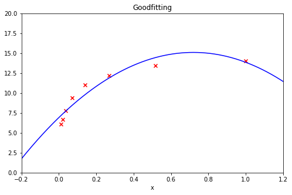
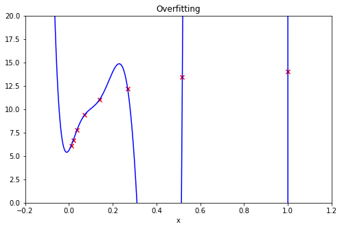
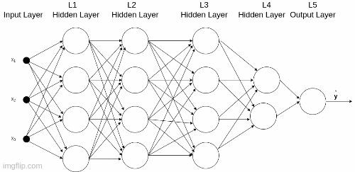
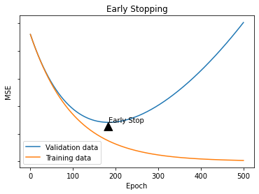

# Regularization

## Background: Overfitting
Overfiting is one of the most common prediction problems in deep learning systems. Avoiding overfitting during the training phase is a key chalenge. An overfitted prediction model fits well for the training sequence, according to which it was fitted, but shows bad performance for validation data not seen in the training set. This behavior is a result of fitting to the model to the details of a particular set of training data. 
Reasons for overfitting may be a too complex prediction model (e.g. too many nodes or layers), and a too short training sequence.

Figure 1 illustrates underfitting, goodfitting and overfitting. Figure 1a shows underfitting. Common reason for underfitting is a too simple model. Anyway, this post is about a set of techniques used to avoid overfitting, named **Regularization**.

### Figure 1a: Underfitting

 
### Figure 1b: Goodfitting

  
### Figure 1c: Overfitting

## Regularization Techniques

As mentioned above, Regularization applies to a set of techniques which aim to prevent overfitting by simplifying the system, stopping the training when just when weights begin to overfit, and increasing the effective size of training system. 

The regularization techniques presented here are:

- L2 Regularization
- L1 Regularization
- Dropout
- Early Stopping
- Data Augmentation

## L2 Regularization

L1 and L2 Regularizations are both similar methods, which aim to prevent overfitting by effectively simplify the system. We'll see that.

The cost function is incremented by a regularization coefficient as shown by Eq. 1. BTW, to be more precise, L2 Regularization is actually L2 Squared Regularization.

### Eq. 1: L2 Regulated Cost Function

The regularaizd cost function (Eq. 1), effects the Gradient Descent formula :

### Eq. 2: Gradient Descent Iterative Formula

\\(\mathbf{w=w-\alpha \cdot\frac{\partial C}{\partial w}}\\)

Let's plug the L2 regulated cost function (Eq. 1), to the Gradient Descent formula (Eq. 2), and get an L2 Regularized Gradient Descent Equation.

#### Eq. 3: L2 Regularized Gradient Descent (not final)

\\(\mathbf{w=w-\alpha \frac{\partial \hat{C}}{\partial w}=w-\alpha(\frac{\partial C}{\partial w} + \lambda \frac{1}{2}\triangledown_w  \begin{Vmatrix}w\end{Vmatrix}_2^2)}\\)

Where \\(\lambda\\) is the regularization rate parameter. 

Let's calculate the Gradient of the regularizing L2 norm. To find that, let's derivate the L2 norm with respect to \\(w_{ij}\\):

### Eq. 4: Derivative of L2 norm with respect to \\(w_{ij}\\)

According to this, the L2 norm Gradient expression is given in Eq. 5.

### Eq. 5:  L2 norm Gradient

\\(\triangledown_w \begin{Vmatrix}w\end{Vmatrix}_2^2=2w\\)

Plugging the L2 gradient back to the Regularized Gradient Descent equation(Eq. 3) we get:

#### Eq. 6:  L2 Regularized Gradient Descent

\\(\mathbf{w=w(1-\alpha \cdot \lambda)-\alpha \frac{\partial d }{\partial w}C}\\)

**Conclusions**:  Eq. 6 shows that the L2 Regularization factor diminishes the resultant weights by a factor of \\(w\alpha\lambda\\). The L2 regularization factor includes w as a multipicand, so the shrinkage of w is decremented as w decrements. That will provide smaller weights, but will not zero the weights, i.e. will not make sparcy weight matrice. Shrinking weights restrains overfitting, as large changes in the input will be translated to less changes in the output. 

## L1 Regularization

The cost function is regulated by a L1 norm as shown by Eq. 7.

### Eq. 7: L1 Regulated Cost Function

The regularaizd cost function effects the Gradient Descent formula. Let's plug the L1 regulated cost function (Eq. 7), to the Gradient Descent formula (Eq. 2) and get:

### Eq. 8: L1 Regularized Gradient Descent (not final)

\\(\mathbf{w=w-\alpha \frac{\partial \hat{C}}{\partial w}=w-\alpha(\frac{\partial C}{\partial w} + \lambda\triangledown_w  \begin{Vmatrix}w\end{Vmatrix}_1)}\\)

Let's calculate the Gradient of the regularizing L1 norm. To find that, let's derivate the L1 norm with respect to \\(w_{ij}\\):

### Eq. 9: Derivative of L1 norm with respect to \\(w_{ij}\\) (Not final)

According to this, the L1 norm Gradient expression is this:

### Eq. 12:  L1 norm Gradient

\\(\mathbf{\triangledown_w \begin{Vmatrix}w\end{Vmatrix}_1=sign(w)}
\\)

Pluging Eq. 12 into the L1 Regularized Gradient Descent expression (Eq.8) gives:

### Eq. 13: L1 Regularized Gradient Descent

\\(\mathbf{w=w-\alpha \frac{\partial \hat{C}}{\partial w}=w-\alpha\lambda\ sign(w) -\alpha\frac{\partial C}{\partial w}}\\)

**Conclusions**:  Eq. 13 shows that the L1 Regularization factor diminishes the resultant weights by a factor of \\(\alpha\lambda\ sign(w)\\). Unlike L1 regularization, the  factor is dependent on w, so the reduction factor is not dectemening with w. Here some of the weights may be zeroed, making the weights matrix w sparsy. The effect of sparcy weights is of a simplified system, where a fraction of the nodes is not operative during some periods of the training session. 

## Dropout

When implementing droput during the training session, a fraction of the DNN nodes is cancelled, which results in a simpler network, and thus may avoid overfitting. The dropout rate P determines the drop probability, acording to which nodes are cancelled at every training phase's fitting iteration. Dropout can be applied to the input layer. the hidden layers but not to the output layer. Figure 2 illustrates dropout.

### Figure 2: Dropout

## Early Stopping

Background: It is assumed that the coefficients learning procedure is carried by an iterative algorithm, e.g. Gradient Descent. In suc algorithms, the training data runs through the training procedure repeatedly till convergence. BTW, each itteration run of the entire training data is called an Epoch. 

Problem is, although more training epochs seem to improve performance, the updated farther coefficients may actually be overfitted. To prevent that, part of the training data is kept for validation only. The prediction performance is tested now not only with the training data but also with validation data. When performance f validation data decreases, the training procedure stops, as depicted in Figure 3.

Note that in Keras, the setup of EarylStop involves with some attributes such as: 
- monitor: Quantity to be monitored, e.g. 'val_loss'
- mode: Here ('auto', 'min', 'max'). Relates to monitored value. 'min' would stop if monitored value stops decreasing, 'max' if stops increasing, 'auto' - will stop according to nature of monitored value.
- patience: The early stopping will still wait for some epochs before stopping. E.g. if patience=4, it will stop only if 4 consecutive epochs stop decreasing.
-restore_best_weights: Whether to restore model weights from the epoch with the best value of the monitored quantity. If False, the model weights obtained at the last step of training are used.

### Figure 3: Dropout Early Stopping

## Data Augmentation

Data Augmentation is one more regularization technique. Over fitting can be avoided by increasing the training sequence. As more training data is required, in many cases it is complicated or in some cases may be even not realistic to get more data. Augmenting the available training data may be helpful here. Augmentation is common in CDNs (Convolutioal Data Networks), which typical data set consists of images. The augmentation is done by applying various manipulations on the input data such as the geometrical transforms: rotations, translations, scaling, flipping, shearing.

