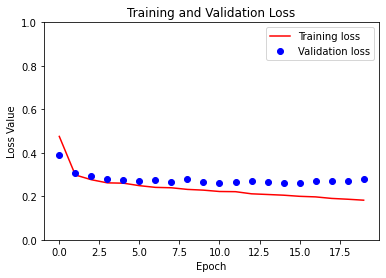

# Building Tensorflow Image Pipeline


## Introduction

A Neural Network consists of 2 main components: The Input Data Pipeline and the Network Model.

Having that in mind, a major part in the bring up of any Neural Network, besides setting the model itself, is the setting of an efficient input data pipeline.


The costruction of input data pipeline is an Extract, Transform, Load (ETL) task, so it starts with the extraction of data stored in memory or in files(s), continues with transforming it, such that it will have an efficient data format, and then loading it to the model.

In tensorflow, the data should be extracted and arranged as a tf.data.Dataset object, and then pass through a list of transformations such as decoding batching, normalizing, resizing, shuffling, augmentating, and so forth.

This presents some approaches, each uses a different tf module, for the creation of an image data pipeline. All are alike, in the sense that the output is a tf.data.Dataset object, so all provide an efficient, multiprocessing capeable, yet simple processing forms.

The various data pipeline creation methods are demonstrated over an image classification example - Rock Paper & Scissors.

The source data, `Rock Paper Scissors dataset`, is listed in TensorFlow Datasets catalog. The dataset was produced by Lawrance Moroney, million thanks for him on that.


## The Image Data Pipeline Creation Approaches

This post reviewes 4 approaches:

- Using **tf.keras.utils** module
- Using **tf.data** module
- Using **tf.keras.preprocessing.image.ImageDataGenerator**
- Using **TFDS** module - (which is good only for TensorFlow Datasets)
                                                                                


## Arrangement of This Page

In the following we will go step by step through a data classification code, The dataset creation is illustrated using the 4 methods specified above, so the 
sections which follow are:

1. **Import Packages**

2. **Download the data**

3. **Create the dataset** 

  3.1 Using tf.keras.utils module

  3.2 Using tf.data module

  3.3 Using tf.keras.preprocessing.image.ImageDataGenerator

  3.4 Using TFDS module

4. **Set the Netowrk Model**

5. **Compile the Model**

6. **Train**

7. **Display Model Summary** 

8. **Visualize Training Results***

9. **Run Inference**


...Here we go...!


## 1. Import Packages


```python
import tensorflow as tf
import tensorflow_datasets as tfds
import matplotlib.pyplot as plt
import numpy as np
import os
import PIL
from tensorflow import keras
from tensorflow.keras import layers
```

## 2. Download the data

***Rock Paper Scissors***
We will use the `Rock Paper Scissors` dataset, listed in [TensorFlow Datasets catalog](https://www.tensorflow.org/datasets/catalog/overview). The dataset was produced by [Lawrance Moroney](https://laurencemoroney.com/datasets.html), million thanks for him on that.

***Downloaded Data Format***

Here we download the dataset, which is packed as a .zip file. 


```python
import pathlib
dataset_name = 'rps'
dataset_url = 'https://storage.googleapis.com/laurencemoroney-blog.appspot.com/rps.zip'
dataset_file = tf.keras.utils.get_file(origin=dataset_url, fname=dataset_name+'.zip', extract=True)
```

dataset_file point on downloaded file:


```python
print(dataset_file)
```

    /root/.keras/datasets/rps.zip


The downloaded zip file file was extracted , due to the `extract=True` attribute.

Let's examine the zip file and the extracted directory: 


```python
import os
dataset_dir = pathlib.Path(os.path.dirname(os.path.abspath(dataset_file)))
!ls $dataset_dir
```

    rps  rps-test-set  rps_test.zip  rps.zip


#### Each dataset subdirectory to a data class: paper  rock  scissors. Here's the subdirectory list:


```python
subdir_names = [f for f in os.listdir(os.path.join(dataset_dir, dataset_name))]
print(subdir_names)
```

    ['rock', 'scissors', 'paper']


The zip file downloaded so far holds the `training` data. 

The dataset's author composed another zip file which holds the `test` data. 

Next download it:


```python
dataset_test_name = 'rps_test'
dataset_test_url = 'https://storage.googleapis.com/laurencemoroney-blog.appspot.com/rps-test-set.zip'
dataset_test_file = tf.keras.utils.get_file(origin=dataset_test_url, fname=dataset_test_name+'.zip', extract=True)
```


```python
!cp -r /root/.keras/datasets/rps-test-set/* /root/.keras/datasets/rps
```

The `train` and `test` datasection are split 80-20. That is fine. but for methodical reasons, The straight forward way to do is to take them as is for training and validation respectively. Methodicaly, we will merge the 2, just to demonstrate the split capabilities of the method which follows in the next notebook cell.

Let's check how much data have we got by counting number of files in each class directory


```python
from os import listdir
from os.path import isfile, join
import os

class_dir_info = {}
file_ext = 'png'

base_data_dir = os.path.join(dataset_dir, 'rps')
for subdir_name in subdir_names:
  subdir = pathlib.Path(os.path.join(base_data_dir, subdir_name))
  import os, random
  files_count = len([file for file in os.listdir(subdir) if file.endswith(file_ext)])
  class_dir_info.update({'dir': subdir})
  print('{}: {} files'.format(subdir_name, files_count))

print('total file count: {}'.format(len(list(pathlib.Path(base_data_dir).glob('*/*.{}'.format(file_ext))))))
```

    rock: 964 files
    scissors: 964 files
    paper: 964 files
    total file count: 2892


***Visualization*** - take a brief look at randomly selected images from each class


```python
plt.figure(figsize=(15, 15))
for i, subdir_name in enumerate(subdir_names):
  path = pathlib.Path(os.path.join(base_data_dir, subdir_name))
  filename =random.choice(os.listdir(path))
  ax = plt.subplot(1, len(subdir_names), i + 1)
  img = PIL.Image.open(os.path.join(path, filename))
  plt.imshow(img)
  plt.axis("off")
  plt.title(subdir_names[i]+str(img.size))
```


    

    


## 3. Create the Data Pipeline (Extract + Transform)

Having downloaded and extracted the source data files, we we start the creation of data pipeline. So now we demonstrate the various approaches.


**Common Parameters consumed by all approaches:**


```python
batch_size = 32
image_height = 224
image_width = 224
```

Each of `3.x` paragraphs which follow correspond to a different data pipeline creation approach. 

### 3.1 Create the Data Pipeline Using **tf.keras.utils module**
This approach uses `tf.keras.utils.image_dataset_from_directory` method to create the dataset from the source image files.

This is a convinience method, with helpfull features such as:
- Option to automatically obtain the data lables according to the subdirectory name, ("inferred" mode). 

- Transparently supports various image coding formats: : jpeg, png, bmp, gif, where Animated gifs are truncated to the first frame. Accordingly, it is not needed to explicitly decode the images e.g. no need to decode jpeg images. 

- Supports attributes for data transformation such as batching, shuffling and splitting


**Preliminary Requirements:**

For Labels `Inferred` Mode (which deployed here)- It is assumed that source image files are arranged in subdirectories, each corresponds to a class, as illustrated in the image which follows:

**Image Source File Arrangement**


![image.png](data:image/png;base64,iVBORw0KGgoAAAANSUhEUgAAAikAAAEcCAYAAAACzCSdAAAABHNCSVQICAgIfAhkiAAAIABJREFUeF7tnQm8lVP3x5cUoSI0qVAoU1EiCRWhEA2aaFRp0IgKGf8qSioklaGoKFSSoTKEQsmQeSihSJLQSzPPf/+W9znvuefs555z7j3D85zzW5/P/dx79t7PHr7Pc89ZZ+211t7LMSIUEiABEiABEiABEvAZgSI+mw+nQwIkQAIkQAIkQAJKgEoKHwQSIAESIAESIAFfEqCS4svbwkmRAAmQAAmQAAlQSeEzQAIkkDUEvv/+e+nZs6cceeSRsu+++0qFChWkadOmsmjRojxrPPTQQ2X48OFZs24uhASylQCVlGy9s1wXCeQYgZUrV0qtWrVUIenfv7/MnTtX7rzzTtm1a5c0adJE7rnnnhwjwuWSQPAJFA3+ErgCEiCBXCewe/duadeunVpOli1bJqVLlw4h6dy5s/To0UNuuOEGadWqlVpZKCRAAsEgQEtKMO4TZ0kCJJAPgQULFsjatWvVWhKuoOCSvfbaS8s/+OADTwVl5syZaoUpUaKEYCvokksukW+++SY0IpSg6667Tg4//HApXry4VK5cWa655hq10kBi1eczdVaRAAnkQ4BKSj5wWEUCJBAMAm+++abst99+ct5551knfOCBB8qJJ55orVuxYoV06NBBmjdvLu+9954sXLhQtm/frlYXV0aNGiXTp0+Xhx9+WD7//HOZPHmyPPXUU3Lbbbdpk1j11oFZSAIkEJMAt3tiImIDEiABvxPYuHGjVKpUSfbee++Ep3rSSSep1QTbQEWK/Pu9bcCAAdKsWTPZtGmTlC1bVq0wUHLOP/987b9q1aryyiuvhNrHqk94UryABEhACdCSwgeBBEgg8ASKFSsmf//9d4HWgSigWbNmSfXq1WWfffbR7SEoKJAtW7bo70svvVSWLFkibdu2lWeeeUZ+++03OfbYY6VatWpx1RdoYryIBEiASgqfARIggeATqFixoqxfv1527NiR8GKwhXPLLbeoY+3mzZsFJ4W8/PLLefqB8+3zzz8vf/31l3Ts2FGtK3DU/eWXX7RdrPqEJ8ULSIAElAAtKXwQSIAEAk/g3HPPVefVZ5991roW+JjcdNNNqoREyrx586Rx48Zy5ZVXSqlSpbQa20eRcuGFF6qiAusKLC9Lly7VnCyuxKqP7I+vSYAEYhOgkhKbEVuQAAn4nECjRo2kRo0aMnjwYPnhhx/yzBaWEfiYjB07Vv7444+olfznP/+RkiVL5il//PHH9bV7/ur8+fPlu+++0zI46MKptlevXvLhhx9qWax6bUQhARJImAAdZxNGxgtIgAT8RqBo0aIyY8YMje6pXbu29OvXT2rWrKnbMVA4li9fLlOnTpWjjjoqaur16tWTKVOmyDvvvCPlypWTu+++W44++mjd8kG0zxFHHCHjx4+Xbdu2aR3Cj9etWyezZ8+Ws846S/uLVR81KAtIgATiIkAlJS5MbEQCJOB3AlBK3n//fVUkHnvsMfnxxx/l4IMPljPOOEPefvttqVOnjnUJN954o6xZs0Yjd7Dd06dPH/VPQd6Vq6++WtPrQyG59tpr1XEW2z3wSUEulbvuukv7jFVvHZiFJEACMQnsZcyZTsxWbEACJEACJEACJEACaSZAn5Q0A+dwJEACJEACJEAC8RGgkhIfJ7YiARIgARIgARJIMwEqKWkGzuFIgARIgARIgATiI5BUx9mdO3fKJ598Il9++aU6on3//feyYcMGTS2NDI1bt25VD3nkM0B2SGSJhFPaAQccIDhb45BDDlHveiRmQopqeNgfd9xxmtmRQgIkQAIkQAIkkFsECuU4++uvv8qrr74qONwL4XvIGYBzMKBYHHPMMRq6B4UDige87OE5v//++6tygtTTUFSg2CCL4++//y7oD0mUkOcAOQlWr16th3n99NNP6pl/+umny9lnny1I3ATlhkICJEACJEACJJC9BBJWUpB3AOF2yOz41ltvaV6Chg0bapjfqaeeWqADvmLhRQKmlStXahjh66+/rkoRsjvi1NLLLrsslCUyVj+sJwESIAESIAESCA6BuJUUHK6FMy6efvppPbMCGRdxCJd7amg6l4wMkUhPPXfuXEFKaxyz3q1bt1BipXTOhWORAAmQAAmQAAmkhkBMx9kFCxbo9goyONatW1e3ZJDBEaeCZkJBAQaksG7fvr0qTD///LNmlrzqqqv0/A0oLxQSIIH0Evjmm2+ke/fumtEVaeMPPfRQ/dLw1FNPJTSRTz/9VLeCly1bltB1OJMH1+GEYsiECRMEWWiDJGA2fPjwIE2ZcyWBlBPwVFLgX4LtlGHDhqmVAm8e/fv3jzrjIuUzjDEAnG2vueYa+eKLL/SAsOuvv15at26trykkQAKpJwA/stNOO02d5kePHq0KBg7gg08aMrROnz499ZOIGAFn+UycODHl43722Wfq5J8Mueeee3Qbm0ICJPA/AlYlZdSoUWo1adCggXz88cdy+eWXB4IZ5gll6pRTTlHrCr5NUUiABFJLYM6cORq9BysmtoHx/werJs7SadmypbzxxhupnYCl9xNOOEGtqzbZs2dP6OBAW30iZUjDX1hBtCOkc+fOeu4QhQRI4H8E8igpiLSBvwkidhBGPGjQoECygjXlgw8+kCeeeCLPUeqBXAwnTQI+J4APfWy12LZ/ocDAlw2Cw/rQDr/DBakGrrvuujxlSFsAnzekJ8A2yJAhQ+Sff/4JtZk8ebIcfvjhurVUv359gUUjXCK3exBdeN9998nFF1+s17inIUPJwHY2xkH0Ibaxv/322zx94WDC6tWrS/HixTUdAl5DbrvtNlUskGoB68IhgxBEJ8KChDERhYjTmWfOnBnqE1/80P6ll14SKFP4QgiJ3O6JNTcoN+AGDpgbDj6EVXnXrl3a344dO3QcbiGF0POPABIIKSkIA4apsUyZMrJ48WKpWrVqAJfzvynjjQHRQFgXIoAoJEACqSGAg/ng/4EoP/iwIRdSYQVfNNAvto7wwTtmzBiZNGmSdrt06VLp1auXWmlWrVolOCAQh//lJ/vss48qSyeffLJGB5YoUUKVC2wLoQ6Riq+99pqmQoAVCB/wEPjU9OjRQ7eS0aZnz566/Q3lC4oTtsChHCDqEXOCgoCIR6ROgFM/FJIWLVqocz/YQDAe5Pbbb5ehQ4fKtGnT9HW4xDM3WLyxlYZ1YTwobpgvlCfI3nvvLRdddJGmg6CQQGAJ4IBBiDnR0zFvBu7LrPrdqVMnx7zJZNWauBgS8BMBE2nnVKpUCYeVOiYPkmNSEjh33HGHY6wKoWmaNAJaj9/hYpxtHaNkaJHxa9E2ffv2zdPGKEDaJ8QoDY45hdgxFpxQm0cffVSvM870Wnb//fc75kM6VG/yNTkmRULoNf4wSoZjnPAds1UVKl+3bp1jLEKOscJqmfG1cYyPW9R1xmqiZUbJcIzvTajepGbQeRiFJs81ZgvMMcqLlpn8T9pm8ODBedoY/zplBolnbkb5cc4555w8fRhfPOerr77KU8YXJBBkAmpJgTkQZkE4bmWj4Nh2848b+iaWjWvkmkggkwRgLcC3f1gpYAXB+8mtt96q0T6IwktU4A8XLrVq1dItaAisBvA5g6XAFSR6jCXI4xQuyL0EH5CDDjooVAyrCKzISE6J7SVsG0deBwvGgAEDrMNhiwbzipwPHIth9QmXyH4TmRvaYmsKqSGwtYSoJvgFYTuqWrVq1rmxkASCSKAI0tbjzWTs2LFBnH/cc8b6brnlFs1wSyEBEkg+AfikIOz4//7v/3SbBmHJxx9/vDqwun4S8Y6KqL1wgc8Itm4hyJOEYzTCJfK1bZzSpUvnKcYxHdg6gj9H+A/mjdQG2LaCvw18WOIV9Im5RPrnYGzUhUvkfMLrYs0NbeEPA2dlcOnYsaMY65L6FGLriUIC2UKgKJzAsJcadB+UWDcE32Sw14z926uvvjpWc9aTAAnESQAfqPigrFChQp4rEJoLfxJ8gOKYC1hXbLJ9+/aoYtex1a2Arwj8SCBQWCLrkb8pUYEyceaZZ6ovR6QgFxOUE/jaJNI3+sTcjHk9z3q3bNkSpVhFjhn+Otbc3LbwI8QPGL744ovqIwO/GSS6pJBANhAoAg9zOKDlgrRp0ybkvJYL6+UaSSAdBBBdg/8tnMUVKV9//bVuf8Ah391WCbcoIMcKzuaKlOXLl+cpwlYJrDIQRNrAITV8PByXkajgiwusJtiSwjaJ+wMrCBQuzNt1tA3ve+DAgYIfV6CQuIIzxjCvFStW5JkOnPjz296JnHusuaH9/PnzVfmDQKFC+De+cCLHFYUEsoVAEeQVyZXYfOwT8x84Wx5drsMvBEaMGCFQKmCpfPLJJzUKZuHChWpFGTlypPTu3VuwtYFQWWxJIGM1omcQZoxv/lBgXHE/8BEZg4RwCAdGODH6NA7w2gzZpnEtFAUoK/B5sUXIxOKDD3QoTF26dNF+cKAp/POgDMEXBYIxEPVz8803C/xNjEOuzqdevXpaj3VB0YIvDubapEkTDSvGmsEEfcJHB4nuwCNeiWduCHmGP4o7NvLR4Fw1bLlBEKKMhJwF8QmKd55sRwLpIBBkx9+E526AJnwNLyABEsifgPHtcIxFViN8TIitU758ececWO6YhG6OsSyELjaWW8ecku6Yb/6OsVw4JixXo3aMI6q2MYqARr4YJcdp2rSptjP5QxwTZuwYR9ZQP+PGjXMOO+wwx+QhcYzC4BhLi17nRuXYontM9uyoRZicLY7Jk+KY09kds42kfWGO4WK2gxwTxqvrMk6pzkMPPRSqNs7Cug6zFeWYkGItR0STsSw5ZstGrzFfAh1E/bjiRve8/PLLecYJj+5BRay5Gb8Zx4Q2K2uMA/Z9+vRxjOKl/ZotIGXiRgzlGYwvSCAgBLBJ7GC/ND8nrnRoSukYA97vSLBk7k06huMYJEACJEACJEAChSCgIciuabMQ/QTi0lxZZyBuBidJAiRAAiRAAjEIqJKSK57gubLOGPec1SRAAiRAAiQQCAK63QNvdjh4ZXMY8tq1azU9NBI0cbsnEM8mJ0kCJEACJJDjBNSSgjMkEvE8DyIzrA/rpJAACZAACZAACQSDgFpSYFlAimWcRpqNqfFx+NiaNWs0rwASStGSEoyHk7MkARIgARLIbQIhJQUZI80hg5ojALkAskX69eunZ30899xzmqmSSkq23FmugwRIgARIINsJ6HYPBB/gSKuMcx9wRDp8OIIsmD/WgfVgXVgfhQRIgARIgARIIDgEQkoKpmwSI2mWR5PcSFNEm4RJwVlJ2Ewxb8wf68B6sC4KCZAACZAACZBAsAjkUVLcqQ8dOlTPnkCaZRyJbrI4BmJVmCfmi3lj/lgHhQRIgARIgARIIJgEQj4pXtM3aasFZ0Tg6HIcud61a1fBCaF+ERzbjpOcp0yZIuXKldOzNpo1a+Y5PfqkeKJhBQmQAAmQAAn4ikBMJcWd7ZIlS+Thhx/Ww6ratWunJ25CGUCOlXQLcp1AeZozZ45u57Ru3Vq6d+8ujRo1ijkVKikxEbEBCZAACZAACfiCQNxKijtbOKLipE1zYJaeTHreeedJw4YNxRwSpkeR43jzZAuOPl+5cqXguHMcyW4O5hIcD48TPnEKaPgpqrHGppISixDrSYAESIAESMAfBBJWUsKn/euvv8qrr76qR4W/88478uGHH8pJJ50k5pRTze56xBFHSMWKFXUbBgf7lSpVSsxpo1KsWLFQKDCOE9+2bZsemY6DDrGt9OOPP4o5XVSz4H7xxRfy0UcfSa1atfR4dHOyqjrEmhNDC0SQSkqBsPEiEiABEiABEkg7gUIpKZGz3blzp3zyySfy5ZdfavI0KBobNmyQTZs2qQIC/xEoJFBMsGWDrSIoLFBc4OcCRaZs2bJijmBXBQfJ5RClU6NGjaRF6FBJibxrfE0CJEACJEAC/iSQVCUlkSUi6ysUhnQLlZR0E+d4JEACJEACJFAwAun3ev3vPDOhoBQMEa8iARIgARIgARLIBIGMKSmZWCzHJAESIAESIAESCA4BKinBuVecKQmQAAmQAAnkFAEqKTl1u7lYEiABEiABEggOASopwblXnCkJkAAJkAAJ5BQBKik5dbu5WBIgARIgARIIDgEqKcG5V5wpCZAACZAACeQUASopOXW7uVgSIAESIAESCA6BosGZKmdKAiTgFwLMc+SXO5H4PJBIk0ICQSGQEiXlzDPP1LN8It/IcCbP9OnTNW0+TlQ+6KCD5NNPP5VKlSoFhRfnSQIk8F8C/LAL3qMQ+Z4cvBVwxrlGICVKCiA+9thj0qFDhyieffr0kT179kSVs4AESIAESIAESIAEwgmkTEnxwjxx4sSQJSW8zQsvvCA33HCD7Nq1S6pWrSqPPPKIVKhQwasblpMACfiAwBtvvOGDWXAKiRBw71mDBg0SuYxtSSAjBNKupNhWuXHjRrW6LF26VE488US555575Oqrr5a5c+famrOMBEjARwT4YeejmxHHVHC/gqpcrlq1So488kh1FaDkBoGURff07dtXypcvH/o56qijPIkuXrxYTj/9dFVQID179pQFCxbI33//7XkNK0iABEiABHKLAJQTKCm33367/P7777m1+BxdbcqUlBEjRgi0XvcHjrResmnTJrWi4OHDD5SVEiVKyC+//OJ1CctJgARIgARyjAA+H5o3by633XabVKlShcpKDtz/lCkpBx54YB5LStmyZT1xwuLSuHFj+e6770I/v/32m15PIQESIAESIAGXABQUCCwpVFay/7lImZKSCLrzzjtP3n77bVm9erVetnLlSunfv38iXbAtCZAACZBADhCANaVz586hlVJZye6b7gslpVy5cjJ16lRp1aqVHH300XLVVVdJmzZtsps8V0cCJEACJFAgAq41JfxiKisFQun7i/YyMzQ5mXInAyGSGeXSen3/BHKCgSTg/h8hSsTP0T1ILPnuu+9KkSL/fh/bd9995dRTT5X7779fjjvuuAKxHz9+vCahRELKoElQ7ls8XLt06aL5uLwETrYDBw6UAQMGJD0aCD6TSErql0Skjz/+uPTr10969+4thx56aFYlTPWFJcXrIWM5CZAACRSWwKOPPio7duzQH6Q7qF27tlx++eWF7ZbXZ5iAzZoSPqVUWlbWrl0rhx12WIYJ/G/4+fPny/Dhw+Wuu+4SJEwdO3asb+ZW2IlQSSksQV5PAiQQGAL77befbifDEuJaVJ9++mmNKKxevbpahfANGYL6m2++WaNIDj/8cM3fFCk//PCDHHHEERqdSEkvgUjfFK/RU6GsIOHohg0b5KOPPpKTTz5ZE5HWr19fjj/+eM1BgwikE044QfN9uQJrB54xXNuwYUNZv369VkF5vuKKKzSy9dxzz1VnYFiJIF9//bW2PfbYY6VOnTrquxkpI0eOlJdffllGjx4tt956qyBh6jXXXBPZTJAwtWbNmtrXhRdeKD/99JO2QcDK2WefLcccc4zO7c4774y6NtMF2O7JGTGwc2atXCgJpIqA+3/0+uuvp2qIpPRrPjgcc15YqK+//vrLMeZ/x2wDadn333/vmG0Bxzjt6+vJkyc7p512mv79zDPPOHXr1nW2bdvm/Prrr07FihUdk0rBGTdunNOtWzctP+WUU/L0rxf6WHDfcv0H99soAo6JIC3wnTrggAMco2Q4n3zyibP33ns7b731lvbVvn17xyi8zvbt2/X5MNtCjlFm9PkpXry4880332g7oyg7Jh+Y/v3ggw86Z511lrN7927HnG/nGIVYny9IrVq1nClTpujfZtvSMdYbZ+fOnfo6XC699NLQc3j33XeHrjdRtjpPo5Doc475QsaMGeO0aNFC/zaKlHPHHXfo30ahc4xvqP72i9CSkmkVkeOTAAmklACSQ8I/AT/wJYD148knn9Qx8Q0U34DhsA/p1KmT+rD88ccf8vzzz0vbtm0F1peDDz5YPv/8c/VnceXKK6+Uiy++2HpGWagR//AdgWRbVkqXLi1nnHGGrhNJS43CIUYh0ecGaTSwxYjnB/nAYKmAwDqCLSMILC+XXXaZFC1aVLeQmjZtquXr1q1TS4pRWPQ1nj3U55dzTBtaJL+EqTh+5pVXXtHnvmTJkmKUc0EKEb+IL9Li+wUG50ECJJB9BIx1JKRIGCuJNGnSJOTwiA+OQw45JLRofLjsv//+mkgSdeHp10uVKhVqN2fOHDHfaNUBlxJMAq6ygshSYxHU7ZaCiLGqhC4zVhV9flzBa2RO/+eff8RYOGTRokVahTxg2EKEGCuLKjGuoBwKDJ4/bAW5ig3qjSWwQElOwxOmuuO4CVOHDh0qmGf37t11TLweNGhQaD6Z/iNuSwr2cC+44ALVDMuUKaNaHb6FuDJt2rRMr4XjkwAJkEC+BOBYCD+TP//8U9shyWR4Zmtjohf8IC1CZB0sMFu2bNHr4Hy7fPly9UUwW0b5jslKfxKAtQA+HO55QKmc5ezZs2XevHmqpKxYsUJuueWW0HCYByx3rri+KvishSIRnuQUzyqsLolKfglTYcG5/vrr5eOPP1bfKvheffDBB4kOkbL2cVtSWrZsKddee6289NJLgjA2mITMnpaapGDuwiJdZ594ZgvtEtobhQRIoOAE9uzZo9+2zB54KILFjWSJLIt8bbsu3jaY8YQJE6RGjRoFn3wGrjznnHPUeRDKCqIh8MUL72tr1qzRLR+cvg5zPczecC5Em169eum3YTjVzpgxQ2cNZ1r0g2+c2PaBuRzvixT/E4BSgNBk/IRbylI5c1hLYKnBeLCi4Eu9qyjDuvfss89q+DCcWZ977jnd8kF4M7aPsDVpfF1UmUY4tfFRUeUlEUHCVDjTImEqHGSRMNX4asl9992nfSM5HiyMlStXFlgMYfnxi8SlpBiHHjEOP3LJJZeE8g20bt1avZpxw6HAwEwED3koMTCj4R8bUGE+xTk+zZo1U+0M/9BoZxyEZMmSJQKPZ9RjDJi5AA6g8AaKvTjjkBTa54NGiZuLfTp46GOvDzcLoN09Qb+A5TxIIFkEGjVqFKWAhCsY2HbIhFSrVi0TwxZ6TEQvQBGBrwrea5DvBNEYu3bt0vcg1yqM5JIffvihRmkYJ0L9gKhXr55+E3ZlyJAh+g0ZChvyVARBsBa/57eJlyO+GOeXKyW8n0woJ+748G2Cgov/GSgfeAbxzA0bNkzwDLnbTfhshF/U5s2b9VIoKHhOYf1Drh8oGokqKOgnPGEqLIVQwt2tSvQJBQk/GKNjx44aSeQnicuJF97DZuKOAa3eyuFilBHHJEnSIvONwzFJkpwnnnhCX5ttIsdoZg7aGHOSA6/oWbNmaV2qPZ51kAgx4COL+JoEfE/AfFD6LirDfGlw/B7d4/sbm+YJuu9/2XDfvv3227j+JxDhYrZ1ChXNk+rbhM9NVzDXwYMHp3rIwPQft08KcgnAJARTE0ydsKJgyydSzIOj8d/t2rXTKnwLQew4LCIwh8KMBCsMJNMez5Fz52sS8CuB999/X33B/CTID0IhgUwRiJXMzfU5gQUebdO1tZMoD2zvIHcJLBzYApo7d65a7Cj/EohruwdNixUrJn379tUf7FsDJExtMJdi38wVbPtA+Qjfn8VrbP2gHfxX3BTVmfZ45kNAAkEhgHTuUFTciICgzJvzJIFUEIDi4bXNk8ltnYKs9aKLLpKFCxdqojf4aeJLPLaCKP8SiEtJgWUE0T1u/Dbiv5EhD/4j8IwOV1LgEQ8PeCggrjKC/TXsiUHClRfX4xkexdBysWfn7gfH4/HMm0gCuUQAXwigqJgEYtZlw0sfygz8wPDj/h1PGcIm8YNwSvfv8N/wi6GQgF8I2KwoQVNOXJZQTJAlFj8UO4GYe1MmTbRjHG0cYz1RnxOjgDjG8coxFhLHKCmanQ5Z94ypSuvM9o4zc+ZM7dc4nmk7o7hotjtkbXTFOO44JhmSvkS9SQmsGR4hJsWv07hxYx3PhP5ppj03C58J/wv5vBjLjWb5+89//hPqN78/DIL8qllHAr4nYL51ee7Fm2iTpM8f//f4v4n8wUDZ4NuQdGA+7tB9/wvyfYv0RQmCz4mPHwnfTy0unxSYoZC8yKTS1X1x/Fx33XUarnfSSSdphA9C+7BHjdAm4xgrDzzwgJqvsCWE19jmiRR4PGMbCB7P8KRHlA9yDsDjGdE7++yzj4Zt9ejRQz2eXSsMPJ7hG4OQQWSLxLkDBfF4jpwPX5NAEAggbBZWTJuYlO36f5RMYR6QZNJkX4Ul4FpRguJzUtj15vz15ob7VpNKhcezn9fr2xvBifmSgEm6FGXdMG9oWobzQJIlOOvG7Tf8N/oP8jfyZPEJUj+4f0G+b7Ci0HISpCeu8HMtgm9eSC7jN0mFxzPWifVSSCAbCCC/AZIo2gQ5D2DBTIbQkpIMiuwjGQSQg8vv0TrJWCf7+B+BIkge46cUuO7U4PFsfFJ0ywhzhIm7sB7PWCf6opBAthBAUij3ALLINSGTJI5nL6zgQ4FCAn4ggNQXfg0l9gOfbJxDEUTsIJzYb+J6PCOyCG+SOJypsGmnsU43Qslv6+V8SKCgBJAxFdmgbYLcRm+++aatKq4ypBtA7iMKCZAACWSCQJGuXbvKpEmTQsdGZ2IS6RgTp0pinVgvhQSyjcD8+fPl9NNPj1oWzgyBpQXp3Qsi+IIQfvgZ+gg/NbggffIaEiABEoiXQFET2iu33367ngmAQ46yVbA+rBPrpZBAthEwIft6Kq9NYB4vqInc5o+C7JhuBmnbeCwjARIggWQR0BDkm266SQ/Qwmmg2ShYF9aHdVJIINsIIB3A0KFDrcs6//zz9YReHGVRELH5o0BJwf8TfnAwmvs3f//LxO8cCvIc8BoSyBSBUJ4UcyCgZo8Nykme8QLDerAurI9CAtlGAPmDTCiydVk4P2vRokWax6igYrOkwJmdQgIkQALpIBBKi4902C+++KIeIohvX/CCXWJaAAAgAElEQVTfqFq1ajrmkJIx4IPSq1cvPUcI60JqcAoJZBOBJk2aqBJikz59+mhCxcKKzWkWyRfDxWSfLuwwvJ4ESIAErATynN2DD3LkVhg1apSeyojfJs229UI/FyIXCszfd9xxh6cZ3M/z59xIID8COBerTp06ns6w2NbEs58MsW33hFtSGjRokIxh2AcJkAAJWAlY0+LjA37FihWCb0g1a9YMzFYJtnQwX8wb8/fap7eSYCEJBIDAzz//rMdPeEXrQEFPloIC3wqbkhJpSQkANk6RBEggoAT2Mm9ESHntKQsWLJDx48cL3hxxng5CeM1hg57t011hDhaUqVOn6lk+OGl54MCB0qxZs3RPg+ORQMoJmAM6Ncx427Zt1rFwdD18VBKRp59+Wo+GtwkUFJvDbYy3DFtXLCMBEiCBAhGwWlLCe8IH/quvvirmxGK1TiBHAt4IkZcBZudMCMbF+JgH5oN5YX6YJxWUTNwRjplqAni2YSW0KShFixYVfJlIVEF56KGHpE2bNrJs2TLr9G1WFBz4SSEBEiCBdBGIqaS4E2nUqJHMnDlTfvzxRznttNNUKYCzLTJdjh07VnM0mAMBUzJv9Iv+MQ7Gw7gYH/PAfDAvzI9CAtlIAKd+44gIm5QvX163Ny+++GJbtWcZMjjDMgqBovL1119HtbUpKfBVo5AACZBAugjkcZyNZ9AyZcpI37599QfZLPEND2m3oShgn/ykk06S4447To455hjdO69YsaJuwyDKplSpUrL//vtLsWLFNMU9zMa7d+/Wb4dbt26VLVu26LYSFA+EPq5evVq++OIL+eijj6RWrVpSr1496dChg27vMOtlPHeLbYJO4N5779UtTJvUqFFDnnrqKXVyT0TgWDtixIjQJT/99JPgnJ/Fixfn+b+ikpIIVbYlARJIBYGYPimJDLpz507BvvmXX34pa9asUUVjw4YNsmnTJlVA4D+CH1hGoKBAUcEZPfBxwQ8UmbJly2pWWCg4Rx99tL4B482YIcSJ3Am2zQYCkcpE+JoaNmwos2fP1v+XRARfLrxCk2GNwbaRK126dBH4uYQLUhP07NkzkSHZlgRIgAQKTCCpSko8s7AdEkhHvHjIsU0uEcBWDHxGbNKyZUu1oEDBj1dgrUSfsHjmJz169FAndAgUocgcKEuWLNFyCgmQAAmkg0DcPinpmAzHIAESEGnevLmngtK9e3eZM2dOQgoKtnPgdxJLQQF7KEY33HCD3oZ4ErnxfpEACZBAKgkk7JOSysmwbxLIdQL169eXt99+24phyJAhmmAxEYFPFywoXhE8tr7uuusuOfTQQ2XdunVR1TygMwoJC0iABFJIgNs9KYTLrkkgXgK///67nHHGGeoobhMoDokmJ3znnXdUQfn0009tXQoOJrzssss090o8glBnOLpTSIAESCBdBLjdky7SHIcEPAgg/BcRcV4KCnxEElVQXnrpJVVAvBSUO++8UxCGXLduXc/zfyKnm2gUUeT1fE0CJEACiRKgkpIoMbYngSQSwDYMotc2btxo7RX+J3BmTUSQVwV+LYisswmUnuuvvz5UhQNF4YgbS6BIUUiABEggnQSopKSTNscigTAC8+bNk7POOkt27doVxaV48eKCSBpE8iQiCBG+/PLLrX2iHy+lB6nx3ager/FoSfEiw3ISIIFUEaCSkiqy7JcE8iEwefJkTwWkcuXKetRDoqG+8Fvp3bu3dVQkUXz99dc9x8RFsNhgC8hLqKR4kWE5CZBAqghQSUkVWfZLAh4EcEpxr169rLW1a9fW6B6c05OIYPvGDR2OvA4ROVB6GjRoEFkV9RrOtMOGDYsqRwGVFCsWFpIACaSQAKN7UgiXXZNAJIF+/frJhAkTIov19QUXXCBz587VoyMSESg8sMzYBP4uixYtkgoVKtiqPctgkcHWUbj8+eefem4WhQRIgATSRYBKSrpIc5ycJwBfETi12gRnUk2fPt1W5VmGIyYQYjxr1ixrG2wXQUHZZ599rPX5FeJcLigqTz/9dKgZM0PnR4x1JEACqSDA7Z5UUGWfJBBBoGnTpp4KCg4QTFRBWb9+vcDZ1UtBadWqlTreFkRBwdRxgOfw4cPlnHPO0ZWULl2a95QESIAE0k6ASkrakXPAXCKwY8cOzUWycOFC67L/7//+T8aNG2et8yrEIZ6I+oGVxCawrjzzzDO2qoTKqlWrpooKTjanP0pC6NiYBEggSQSopCQJJLshgUgCSCsPB9h33303skpfwzfl5ptvttZ5FS5dulQuueQSee+996xN4Dzr5Z9ivSBGYb169VRRoZISAxSrSYAEUkKAZ/ekBCs7zXUCUCKwxbN582YriieeeELat29vrfMqfP755/UaOLDaBOHDiM5Jtlx88cWyZcuWZHfL/kiABEggJgE6zsZExAYkkBiBF198UZo1ayb//POP9UJs/SCSJxGZMWOGdOzY0fOSRx99VLp27epZzwoSIAESCCIBbvcE8a5xzr4lMG3aNLnooousCkrJkiVl5cqVCSso2BbyUlCKFSsm8+fPp4Li2yeCEyMBEigMASophaHHa0kgjAC2W7ysGVWrVpVVq1ZJnTp1EmIGfxDkVrFJmTJlNIIHPioUEiABEshGAvRJyca7yjWlnQAcVpGW3iZudM9BBx1kq/YsGzx4sIwZM8Zaj8gbWFDo0GrFw0ISIIEsIUAlJUtuJJeROQL5ZXyF0+mCBQsSmhySpnXr1k2mTp1qve60004TONHCkkIhARIggWwmQCUlm+8u15ZyAm3atMmTlTV8wC5dungqGl4T++233wTXPffcc9YmcLiFY26RItyptQJiIQmQQFYR4DtdVt1OLiZdBGDtOO+88zwVFGzVeFlCvOb47bffCiwvXgpK27ZtNSkcFRQvgiwnARLINgJUUrLtjnI9KSfw888/qwPsK6+8Yh1r9OjRgp9EBE61TZo00ROQbdKnTx/PFPi29iwjARIggWwgwO2ebLiLXEPaCHz66acaTQOrh01gPcF2TSLy+uuvC87a8UqYhqy0SJ9PIQESIIFcI0AlJdfuONdbYAKvvfaaKhO///67tQ9s0yCJWyLy7LPPSosWLTwvGT9+vAwYMMCznhUkQAIkkM0EqKRk893l2pJGYPbs2dKuXTvP/pYtWyb169f3rLdVIPGbV14VtMfJyB06dLBdyjISIAESyAkC9EnJidvMRRaGwKRJkzwVlIMPPlg+//zzhBUUWEi8FBTkU0EEDxWUwtw1XksCJJANBKikZMNd5BpSRmDkyJHSu3dva//Vq1eXL774Qo477jhrvVfhTTfdJIMGDbJWV6lSRRYtWqSHE1JIgARIINcJcLsn158Art+TQH4ZX88880xNSV+0aGL/QvklfqtVq5aGNB911FGec2IFCZAACeQSgcTeYXOJDNea0wS6d+8ujzzyiJVB8+bNZd68edY6r8Ldu3fL5ZdfLs8884y1yTnnnKN1pUuXttazkARIgARykQCVlFy861xzvgRatmzpqYT06NFDpkyZku/1kZWbN2+W1q1bC0KNbYLx5syZY6tiGQmQAAnkNAH6pOT07efiwwn88ccf0qhRI08F5cYbb0xYQVmzZo326aWg4IweKih8DkmABEjAToBKip0LS3OMwOrVq6VBgwaeysS4ceNkxIgRCVF577335KyzzhIkgLPJtddeKw8//LCtimUkQAIkQAKGALd7+BjkPIHly5cLDgpcv369lcWMGTPkiiuusNZ5FSJlPiJ09uzZY20yfPhwGTZsmLWOhSRAAiRAAv8SoJLCJyGnCbz00kuqoPz5559WDggHPv/88611XoVPPfWU4DBAL5kwYYJcffXVXtUsJwESIAES+C8BKil8FHKWwMyZMz0TpuGkYWzXICw4EZk4caKnAnLAAQfo9k5+mWsTGYttSYAESCDbCdAnJdvvMNdnJQBrhldG13Llysl3332XsIKCQwC9LCSVKlVSh1wqKNbbwUISIAESsBKgJcWKhYXZTADKxK233mpd4gknnCArVqwQWD0Skf79+8v9999vveTEE0+Uxx57TGrXrm2tZyEJkAAJkICdAJUUOxeWZikBpKPHuTk2adiwoWaRTVTgVPvEE09YL0N0Dw4KPOKII6z1LCQBEiABEvAmwO0ebzasyTICXbp08VRQkGwtUQVlx44dcsEFF3gqKM2aNdODAtOhoNx+++1Zdre4HBIgARIQoZLCpyDrCezcuVMuueQS3XKxSZ8+fQQROYnIxo0b9eTjxYsXWy/r1KmTPPfcc1KiRAlrfSoKvU5VTsVY7JMESIAE0kGASko6KHOMjBH46aefpHHjxrJgwQLrHOCb8sADD1jrvApx8nHdunXlgw8+sDaBf4qXQmS9IEmF06ZN0+y2f//9d5J6ZDckQAIkkFkCVFIyy5+jp5DA559/Luedd54sW7bMOgoifG677TZrnVch+qpTp46sW7fO2gRKz7333mutS0ch0u8fffTR8u2336ZjOI5BAiRAAiklQCUlpXjZeSYJHH/88TJp0iSpUKGCdRqJbvE8++yzmuZ+27Zt1v6QOj9RpcfaUSELET5dtWpVzxT/heyel5MACZBA2ghQSUkbag6UCQJnnnmmKir77rtv1PBvvvmmwLk1HkESthYtWlib7rPPPoKtloEDB1rrM1WIrR/Mi0ICJEACQSVAJSWod47zjpsAnGahqNjk+eefj3kuz1133SU9evSwXS5I/AaLTOfOna31mS6EMy0jfzJ9Fzg+CZBAQQlQSSkoOV4XKAIIPx47dqx1zshx0rt3b2vdddddJzfccIO1rnr16qqgXHrppdZ6vxRiC4qRP365G5wHCZBAIgSopCRCi20DTQCJ3G666SbrGmBpufHGG/PU4YP9nnvusbY//fTTVUE5++yzrfV+K3Qjf7z8afw2X86HBEiABECASgqfg5wicMcddwjyotjkzjvvlDFjxmgVfFW8/DmaNGkizzzzjNSsWdPWjW/LEPmDtP9fffWVb+fIiZEACZBAOAGmxS/k87DXXnsVsgde7icCgwcPljlz5sjy5cut02rfvr08+uijUrx4cWu93wsR+XPsscdqEjqEZxdU+NwXlFzmr3McJ/OT4AxIIE4CtKTECSq/Zvin50+wGOB+IqW9TbwUFPitwH8lKApKfuHQ559/vipbhRE+88F65qmcFOZp57WZIkAlJVPkOW7GCSxcuFBOPfXUuOYBf5WJEyfG1dZPjZCav3z58tYpdevWjZE/VjIsJAES8AsBbvck6U688cYbcfe0Zs0aueWWWzwPpnM7ev/99+Xwww+XMmXKxN13tjecPXu2ZnvFtkxhBffs7rvvFnxYf/PNN57djR49OinjeQ6Qwgr3kMOrrrpK3nvvvaiRYG3BFtDUqVOj6uIpSOS5j6c/tkk9AfeeNWjQIPWDcQQSKCQBKimFBBh+ebz/9AceeKDst99+Eqs9QmYR/opIkkwLzoPZe++9Mz0NtXzs2bNHSpUqVei5gD/esKE0HnLIIbJly5Y8fcLvYsqUKdK9e/dCj5XJDmrVqiUvvPCC9OzZU5A1N1LgIAxFZd68eXLQQQdFVsd8Hes5jtkBG6SVgPvcp3XQJA22atUqOfLIIwv0nCZpCuwmzQS43ZMm4IgcgVXk5JNP1g8MV7BPjNBYpDHHPx/yeeBDeNSoUbJo0SJNNDZ37lz1ebG1i5w+PmwQFnvMMcdonxgX8s8//2j4LXJ74KdDhw6ydetWrYOPBU71dcV9jQP0MF+0xSF9EDiVwvGyUqVK0rFjR8EJwxCsCdEuqLvwwgsFB/tFykcffaT9QfHCCcJIWw8loXnz5hp1cvXVV4cuefzxx3WeWEPDhg1l/fr1Woctl2uuuUb/Ll26tEyePFngX4HzakaOHBk5ZNyvf/311zxtDz74YA0xDrqC4i6qbNmyqoSEMw5fMCJ/oMx8/PHHcTNjQxJINwEo0XifRILC33//Pd3Dc7xMEDAffmkVs0a4luf5SesEkjwY1gIxb/KePZuD7hzzz+WYD27HKAuOUTyco446StsbnwHHfFg727dvd3bs2OGYD3rnySef1Drzwe288847MduFD2w+hBwTZqtF5p/YadWqlf5Gn+ZDyPnzzz91DpdffrkzZMgQbWdSxuvcXHFfmw8s54ADDnBmzZqlVT/++KNjtp4cc3idYxQp5+KLL3aMEqTXYn2ffPKJtjNhvI5JIR/qz/0D9cYa47z11ltaZCJlnBNPPFHXbvJ3OCVKlHA2bNjgGIXBMYqSY7ZgtJ3ZqnCMFUD/Ntszjtme0b+N9cMxviL69w8//OCY9PTOX3/9pa9jSeQzmI2vzVaOFQPuWX7rNVl4rdeFF8bz3MfshA3STiAb7pvJ7qzPL95z8Iz/9ttvaefIAdNHgJYU87SnWmAtgHUDDozYQoAFwhXzQS8rVqxQawbOl8HWztq1a6OmFG87HKb3yiuvyLvvvislS5bUfB7YXoKlwygmYpQOnUOnTp00DDU/QTtYYFq3bq3NXn75ZalXr55+k8HWD/xDYN1BP5i3UTi0HbYVFixYINgiihRYP8444wwtNoqaHtiHtWP7C3xg0YEVY9OmTWpFgcCSYmOCussuu0zbVKxYUdf2888/62uKN4Hrr79epk+frsxtgmftwQcftFWxjAQyTsCNWoMlBX9XqVKFlpWM35XUTYBKSurYhnqGrwM+nF3Bh7Armzdvlr59+0rdunX1g37+/PmqGERKvO2GDh0qSDaGbYrDDjtMcDIvBB/68LtwBXP45ZdfIoeJeo15Fyny72OCPsJ9Fvbff39VrFC+dOlSVV7wA2XFWEWs/UORcAWKDvoIfw3FBuuHQyuY4OfWW2+1MsF1UMRcwTxtilGoAf8IEcAWHhRJbAvaBAnvIjPw2tqxjATSTQDvMeFnZVFZSfcdSO94VFLSwBsf9OH7p+Hf9t007W+//bYmEMO3WJvE265o0aKCb8rwLYDigLTu8C2BT0K4UgKlB4fjQaAsGOOd/r1r1y79cSU8aVdkH8bMqr4isIDAZwX+MO4P6rxCX0Ode/wBCw38J+CTAysTIqEoySdw7rnnqiMtLFU2gT9TuNXP1oZlJJAJArYcQFRWMnEnUj8mlZTUM9btjTfffFOdSfFNPzzdOhw2a9SooYoCHEtfe+01MX4jOqtixYqFlJv82oUvARlRkf8DUrlyZY2CgWUCoajGL0VwdgteI5HXRRddpO2wVfLZZ5/p33AW9comCkUEypTxsdF1IKx15syZmrkU5atXr9Y+Vq5cKf3799e/CyJYK74twWoDZQe8XCYF6Y/XeBOA8zIcs2FZscmMGTM0Ci1I22hwPMczjG1E/MBaB4ftWNubtvWzzJ8EIq0p4bNMh7ICS7Hxg/MNHAQaYFsfX1BxtIfr8I/3UD/Ns0DA0uf+8u9IZpJRTnvpnkMyx8N6IPk5zqL+5ptvdoxlwTERK47ZgnGOOOIIvQ5OpHCiPe644xw4hBkLgjqEwaHWeLA7Rslw7rvvvnzbaUf/FeOL4pxyyimO+Sd2jE+HY7ZKtMYoFc6wYcOcatWqOcbEr86ncKKFGMuFzqFRo0bqmGr8WtQRFY6uRoH5b8///kJbXI+1mA82dfaFwNnSKFvaj/lAcIwVJ891eIH+3HXjNeZ27bXXhtqBjVFwHLN95JhtHh0HczIWJh0PTrKRjrNGMQpdD0fa8NdREwgrsD2HXo6m+fWTTXVwpLZxQRmeJ9wbV+J97jPBZ/fu3boOY+XT4fHaKN+O2Rp0jM9TSqcEh3I/i5/vW6Lc4MDv9byGl6fCwdYo7fqe6hdp2bKlfk5AEDzwxx9/6N9GcQn9H/hlronO499P2ESvKkR720NViO4yfmk2/dNnHGYaJ2B7DnNdSQF+KNA2Nm6ZCUHXu+Tn5z5SSXEfq5NOOskxPl/68rHHHlOF3ThdOsZS5JgEgVqOyDREnSE6zeTkcYxjd+hN3hzMqG2hTOOLgBulZpIuOugbUXtm68wdzpe//XzfCgLMjfTJ75l165KprCDqEUqwydui995YMBxjMdcvm/jCeumll2rUpvHtCi3L65lDdCOiLfEF7pxzztEvb1gXxOuZC2c1YsQIVcBNWgjHbI3n+SIXrqS4XyTx/DZt2lQjKSFQ9vCcmzQO+v9gUjmEd5/xv6mkFPIWZNs/fSFxBOZy25salZR/bx9Czo3/kaeyMn78+EAqKQh3f/HFF/MNcYeSZnzI1JoHGThwoGNM5/o3QvhNcj/9GxZL45jumDxBTmSovjbwqdie+1wrS4ay4iopyUirYCLpVEmAco00DyafVijNgtczF/l4QSkyEXtaHG5tdpWU/NJEeKWtiBwjU6/pk2L+QykkQAL/I9C2bVt5+umn1Y/DJuaD21bs2zLz5q9HUJhvjhpBFyvEHWHx7lEUcGQ3uYr0KIavv/5aj1CAIPMxoudQFxmq71sQnJgSSLbPSmHTKiBFBVIpIOgBz5Sxcug883vmEr2V+aWJ8EpbkegYqWrPtPipIst+SSDABJDXB4oKHKBfeukl60ratGnjmcHWekGaC5GFGAKndDgII5IJHyhuiDuixyBwzkY2aFfC0wXA8Rz1CLM3/leh3D1oa/b+NWIOof3hofqhjviHrwm4ygrOrULGZTjjFkQSSatge+YQKBCelgLPIvJC5ffMJTrP8DQR7rVumgikrcD/CJxt0Q6vkf/KL0IlxS93gvMgAR8RQDTagAEDBGeleAkiwfx8wCDOZMLxDZHihrgjRB/RD4hgioy4c6+BggIlBOH0eFNHiH2kfPrpp54RcZFt+do/BBANA6sgfsLzP6Vihvk9c5iHcXQNDeseAZLfM5foHN00Ebazu9AXooLwgwhNE6ygEX21a9dOdJiUtOd2T0qwslMSCC4BvKEiy7CXgmJ8UoK7ODPzWCHuy5YtE+NMqGuEIgarEpQdZEhGGD8EFhRkcGZofPAeBSgFxjlVFU7kW0m1ggJC+T1zp512mlr5YOEzPiliIjsVajKfufzSRHilrfDLnfWFkoI93aD++OVGJnMebmz9e++9pwf3UXKHABSQdu3aqdnXJjhgEhaWIAt8bqBkmOgeMWdbiYmOkO+//15MiL4uCwdW9uvXT9OtwxrjJlKEgoJTsfE/gQMyobzAuhI0MQ6Qur2B30H/Cc88G+s+ZEI5ceeU3zOHfFPm3DHdburRo4ceWeLmqkrWM4fEndjWwvOO5xdjYrsWggNb8YzjecdBryivU6dOLJzpq0+3x65ZmWfUQFDrwDBWnpR0cy7MeK5HOLzNzZt5VFd+zwURNWFLge1Zy/XonmzJk2K53XEXIbrHjeaJ+6IANcRzD8mG96t486Tg/QxhvX4+iDA85wrmOnjw4AA9Vamdqi8sKelTyTiSjQCcuXCGy7HHHivmBOWQFg9zP6IhIGPHjpWuXbtqxEe2pqmH6TeoFj3bvHGcfTwCvwukvx89erS1OSwGOLLBV9+urDNNTqF5y01OR+wlpQTw/5qfZNJykt+8IuuwvYP3XmQDx/YhMkDjIFfKvwToOJvjTwLS21955ZWaJv+CCy7Q02+3bt0aRQUp+nGSMj6s3NOJoxqxIHAEcMSByZOg5n+bIF0+TkymkICfCMCfxCRHs04pnQ6x1gkkWIjjSXCUiUmyplE28Adr3rx5gr1kb3MqKdl7b+NaGby5EUoJBQUCawlOwI0UfFOHtzcVlEgywX396quvSu/evUNnLkWu5IYbbhCTfTKyOKtfBy0HTFbfjHwWZ7OiBE05cZcHxWTixIn6Q4km4AslJcjmVdfBKRptMEq2bNmSx7vdPZDNNnuEYlKygwDCbuE8Z1JyWxeEN0woMBQS8BuBSCtKUJUTv3H163x8oaT4FU4uzAtJqJDUyBXsiWJv1CZBV8hsa8rFsrvuuktgJfESc8ZH6IRsrzYsJ4FMEXCtKFROMnUH0jsuHWfTy9t3oyEcDeFv2BOFTJo0SfdFc0FgwQsPxYRlwZVmzZppgiW0CcKPzfxtu4d9+/b1VFAQAvnRRx9RQbGBY5kvCMCKgpwi6c5z4ovF5+gkqKTk6I13lw2H2IceekhN+/iQQupvxNSbMOOcIoNcAciB4cqCBQs0X8DmzZuzggPynpiTfeWBBx6wrsec3isffvih1KxZ01rPQhLwAwFYfdOZhM0Pa871OVBJyfUnwKzfnKCpGTbxz4+kPsh6CIUFIadIZgXBN3D4MWSj3HzzzWLyY0QtDaHZUFTMCaJRdUEqgPKBCAKvlNhdunSRJUuWpCXzZpC4ca7+I4AUCOnIEOu/lefujKik5O6958oNAZyOO3z4cE8W+PCGooKMpEEUWIQuvPBCQfZgm2CbCJkoKSRAAiTgRwJUUvx4VzintBC4//7782zxeA2Ks1ygqCBcO2hyySWXyMaNG63TfuSRR3Rvn0ICJEACfiXA6J4k3BlGvSQBYga66N+/v3XUE088UXCybbi8++67qqjMnDlTjj/+eOt1fivMz5l28eLFgkPHCiN87gtDj9eSAAnEQ4CWlHgo5dPGjfwIjxIJQjRILs9x1qxZnnf0xhtv1JNva9WqFdUGxwRAUfE6HTjqAh8WwNfoyy+/LLSCwuc+GFFftv9zHz6WnBIJeBKgkuKJhhXZSADOozjl1yaI8MGJuMcdd5wqKjhCPVI+++wzVVRgWQmaIIIH80f6bQoJkAAJBIEAt3uSeJfeeOONJPbGrpJNAOcOXX/99dZucX7NPffcE6pD/hgoKldccYW89dZbea6Bb4q79VO/fn1rf34rRARPqhxk+dz77W5zPiSQPQT2MubAtB75advHTvMUsufucSVxE3j55Zfl/PPPt7bv0aOHpwPthg0bVFGxHcB32GGHaVh2o0aNrP2msxAnHnv5oKCcDrLpvBsciwRIIFkEuN2TLJLsx7cEcJCel4LSuXNnTwUFC4IiAouKzdodkmkAABlOSURBVMkUCgwsKsin4leB9YQKil/vDudFAiQQiwCVlFiEWB9oAviQbty4sXUN7du3l2nTplnrwgvLlCmjigryjUQKMtJCUcF5N34T5HjBNg+FBEiABIJKgEpKUO8c5x0XAfdMIlvj5s2b24qtZchyCUUF2XkjZevWraqozJ07N7IqI68RwbN27VqBoyyFBEiABIJMgEpKkO8e5x6TwOzZs6VDhw7Wdm3bttW8J/HKAQccoIrKZZddFnXJ9u3bVVHJL7w56qIUFEAxwVEGVapUSUHv7JIESIAE0kuASkp6eXO0DBCYPn26dO3a1ToyFJh4tnzci3FiNBQVbBVFyt9//63lGC8T4p7BkyunWGeCMcckARJILwEqKenlzdEyRODRRx+Vq666yjo6FJjwE5CtjcIKEaGGM386depkbYpypJxPt6QqxDjd6+B4JEACJOASYAgyn4WcIoDTnB944AHrmidMmCDIl5KIdO/e3VMhmThxovTu3TuR7tiWBEiABEggjAAtKXwccooAFJGBAwda1wwFZvz48dY6r8KHH35YevXqZa3u06eP3HfffdY6FpIACZAACcQmQCUlNiO2yDIC48aNk8GDB1tXNWjQILn77rutdV6FDz74oPTr189aPWDAABkzZoy1joUkQAIkQAL5E6CSkj8f1mYpgdGjRwsOE7TJkCFDZOTIkbYqzzJYTHD2j02gECXan60flpEACZBArhHY26TMvi2di0b67khJ8xQih+frHCVw7rnn6sptZ8+89tprAgfZRHKNXHDBBbJjx46os34wRkH6y9HbwmWTAAmQQIgAlRQ+DDlNAEpIsWLFVImIFJzXs2fPHjnnnHMiqzxfI7stQpHffPPNqDbob/fu3eIqR1ENWEACJEACJJCHAKN7+ECQgCEAPxRs89gE5aNGjbJVeZbld+Dfddddl7Dfi+dArCABEiCBLCZAJSWLby6XlhgBRPbAcdYmiAiCw20iAj+UYcOGWS+BQ22ikUTWjlhIAiRAAllMgEpKFt9cLi1xAsihglBkmyCHCkKYE5H8LDTIoYJcKhQSIAESIAE7ASopdi4szWECyD7bs2dPKwFkrZ08ebK1zqswPwtNt27dBLlWKCRAAiRAAtEEqKREM2EJCQhSzF955ZVWEkijjzT7iUh+Fhqk0X/ssccS6Y5tSYAESCAnCFBJyYnbzEUWhMCMGTOkY8eO1ktxMGGiBwnmZ6Fp166dYDweDmjFzUISIIEcJUAlJUdvPJcdH4HZs2cLFAibtG3bVmbNmmWr8izLz0LTsmVLmTlzphQvXtzzelaQAAmQQC4RoJKSS3ebay0QgXnz5knr1q01/0mkQLF46qmnErKA5GehadasmVpUSpUqFTkUX5MACZBAzhFgWvycu+VccKIEWrRoIc8++6zst99+UZfOnTtXmjdvLtu3b4+q8yrAVhEsMLatnQULFkibNm1k8+bNXpeznARIgARyhgCVlJy51VxoYQhcfPHFAouKzcLx/PPPCxSZrVu3xj0EtopggbFt7SxatEgVlZ9++inu/tiQBEiABLKRAJWUbLyrXFNKCOBsHigqhxxySFT/UCygqPz6669RdV4F7lZRyZIlo5osWbJEFZXvv/8+qo4FJEACJJArBKik5Mqd5jqTQgDn+EBRKV++fFR/OP8HisrGjRuj6rwK4IMCi8rBBx8c1WTZsmWqqKxevTqqjgUkQAIkkAsEqKTkwl3mGpNK4KyzzlJFpXLlylH9Ll26VBWV9evXR9V5FTRp0kQVlXLlykU1effdd1VR+fzzz6PqWEACJEAC2U6ASkq232GuLyUETj/9dFVUqlatGtX/8uXLVVFZu3ZtVJ1XAU5GhqJSqVKlqCarVq1SRQW/KSRAAiSQSwSopOTS3eZak0rglFNOUUWlevXqUf2+//77qqh89dVXUXVeBWeffbYqKlWqVIlq8tlnn6miAssKhQRIgARyhQCVlFy501xnSgjUrFlTw5Nr1KgR1f/HH3+sisonn3wSVedVUK9ePVVUqlWrFtUEvilQVN56662oOhaQAAmQQDYSoJKSjXeVa0orgWOPPVYtKrVr144a94svvlBF5YMPPoiq8yqoU6eOKionnHBCVBNE+0BRQfQPhQRIgASynQCVlGy/w1xfWggcddRRqqjUrVs3arxvvvlGFZUVK1ZE1XkVnHTSSaqonHzyyVFNNmzYoIoKwp4pJEACJJDNBKikZPPd5drSSuDwww9XReXMM8+MGnfdunWqqCCsOF45/vjjVVE59dRToy5BRlooKkgkRyEBEiCBbCVAJSVb7yzXlRECFSpUUEWlUaNGUeMjgywUlUS2ao455hhVVM4444yo/pDhFooKUvNTSIAESCAbCVBJyca7yjVllMChhx6qisr5558fNQ9YQKCoLF68OKrOq+DII49URaVBgwZRTXBmEBSVRE9jjuqIBSRAAiTgQwJUUnx4Uzil4BM48MADVVG56KKLohbzxx9/qKLywgsvRNV5FVSsWFEVlcaNG0c1wenM7du3l+nTp0fVsYAESIAEgkyASkqQ7x7n7msC+++/vyoqOCU5UrZt26aKCsKX45WyZcuqotK0aVPrJZ06dZJHHnnEWsdCEiABEggiASopQbxrnHNgCBQrVkwVFWzJRMru3btVUYHiEa+ULl1a219yySXWS7p37y4PPvigtY6FJEACJBA0AlRSgnbHON9AEpg9e7ZcccUV1rm3bdtWZs6caa2zFZYoUUIVlVatWtmqpU+fPnLfffdZ6wpTWL9+/cJczmtJgARIIGECVFISRsYLSKBgBGbMmCFdunSxXtyhQweZNm2atc5WuO+++6qi0q5dO1u1DBgwQMaMGWOtK0ghxvvll18E/i8UEiABEkgXASop6SLNcUjAEJg6dar06NHDyqJr167y0EMPWetshUWKFJEnn3xSOnbsaKuWwYMHy8iRI611iRQedNBBsmvXLtm0aZMgjJpCAiRAAukiQCUlXaQ5Dgn8l8CUKVN0S8YmV111lUycONFW5Vn2+OOPy5VXXmmtHzZsmNx+++3WungKy5cvL4hGguA3FBUKCZAACaSLAJWUdJHmOCQQRuCBBx7QLRmbXH311XLvvffaqjzLENXTs2dPa/1tt90mUFYSFeRn+fnnn/Nchi0fCgmQAAmkiwCVlHSR5jgkEEFg/Pjxct1111m5DBw4MGGfkkmTJknfvn2t/WHbB9s/8QoOTcRhhpFCS0okEb4mARJIJQEqKamky75JIAaBu+++W2688UZrKygVd955p7XOq/D++++XQYMGWavhSAvlJ5bUqlVLvvrqK2szWlKsWFhIAiSQIgJUUlIElt2SQLwERowYIbfeequ1ORSYRH1Kxo4dK0OGDLH2h20kL38YXFCvXj1ZtWqV9VoU0pLiiYYVJEACKSBAJSUFUNklCSRKAH4jw4cPt16Guptuusla51U4atQoTz8UJHtD0rdIwaGIy5cvjyzO85pKSr54WEkCJJBkAlRSkgyU3ZFAQQnAuRXKhU1gbRk6dKityrMMSg8UHJvA0bZz586hqgsvvFBef/11W9M8ZdzuiYmIDUiABJJIoGgS+2JXJEAChSSAbRqk0r/mmmuieho9erQglT62c+IVbCOhP1t0D0KXkf9k586d8tJLL8XVJS0pcWFiIxIggSQR2MsxkqS+4upmr732imqX5ilEjc8CEvAbgQkTJki/fv2s00IEDxxkExE46Hr5qXj1g4y2kWcOISz522+/9bqE5SRAAiSQVALc7kkqTnZGAskhAEUEIcU2gQLTq1cvW5VnGSKFxo0b51kfWQEFpXXr1lK0aF5jK7Z7/vOf/0Q252sSIAESSAkBKikpwcpOSaDwBJCcDb4jNpk8ebJ069bNVuVZhvBjKDixxFVQ0O6www7L0/yvv/6SH3/8MVYXrCcBEiCBpBCgkpIUjOyEBFJDAOnup0+fbu380UcflU6dOlnrvAqRzRYKjpeEKyhoU6FChaimGzZsiCpjAQmQAAmkggCVlFRQZZ8kkEQCOCF51qxZ1h6hwHidhGy9wBTifCAoOJESqaCgPtKSgjJaUiLJ8TUJkECqCFBJSRVZ9ksCSSTQtm1bmTNnjuy9995Rvc6ePVtatWolf//9d1SdVwFOXA630NgUFFxLS4oXQZaTAAmkgwCVlHRQ5hgkkAQCLVu2lHnz5knx4sWjeps7d660aNFCduzYEVXnVeBaaLwUFFxns6QwV4oXUZaTAAkkmwCVlGQTZX8kkEICzZo1U0WlZMmSUaMsWLBAFZVEom9goUEUj5fYLCnMleJFi+UkQALJJkAlJdlE2R8JpJhAkyZNVFE5+OCDo0ZauHChKipbtmyJqitIQcWKFaMuo5IShYQFJEACKSJAJSVFYNktCaSSwLnnnquKSrly5aKGefXVV1VR+fnnn6PqEi2oXLly1CXc7olCwgISIIEUEaCSkiKw7JYEUk3g7LPPVkXFpki8+eabqqj88MMPhZpGpUqVoq6nJSUKCQtIgARSRIBp8VMElt2SQLoIvP/++5q+fu3atVFD1qlTR+AYW6VKlai6eAsij7LYd999E3LQjXcctiMBEiCBSAK0pEQS4WsSCBiBU045RS0q1atXj5r5e++9J82bN5evvvoqqi7egjJlyuRpigMJN27cGO/lbEcCJEACBSZAJaXA6HghCfiHQM2aNeWKK66wTujjjz+WJ554wloXT6EtDJlZZ+MhxzYkQAKFJUAlpbAEeT0J+IDA2LFj5ZZbbrHOZOjQoXL77bdb6+IptIUhM+tsPOTYhgRIoLAEqKQUliCvJ4EME8BZPNdee611FoMGDZK77rrLWhdvoS0MmUpKvPTYjgRIoDAEqKQUhh6vJYEME5gxY4b06tXLOgscJggLS2HFFj3E7Z7CUuX1JEAC8RCgkhIPJbYhAR8SgLNsx44drTPr0aOHTJgwwVqXaKEtDJmWlEQpsj0JkEBBCDAEuSDUeA0JZJjA4sWL5YILLrDOonPnzjJt2jRrXUEKFy1aJMhyS8kOAo7jZMdCuIqcIFA0J1bJRZJAFhFYtmyZp4LSvn37pCoowGbb7kE5P+yC91BF5rwJ3go441wjQEtKrt1xrjfQBD788EOpXbu2dQ377befnudzyCGH6O/wn/Cy0qVLy0EHHST4jZ8DDzzQ2p9buHXrVmsbKin5YvNlJZQU3jdf3hpOyoMALSkeYFhMAn4j8PXXX3sqKJjr9u3bBb4iBfUXgbLiKjmuAuMqM14s3njjDa8qlvuUgHvPGjRo4NMZclok8D8CtKTwaSCBABCA4mFzYM3k1KEUrVixQvhhl8m7kNjYriUFikoQ79uqVavkyCOPVEsgJTcIMLonN+4zVxlgAr///rvvFBTgLKjFJsC3glPPMAEoJ1BSkJwQ/xeU7CfA7Z7sv8dcYYAJ7N69W0aNGiW9e/eWP/74Q9+Y8Tv8Bz4jmRDmSskE9dweEwoKzqK67bbbZPz48TJw4EAZMGAALStZ/FhwuyeLby6Xlv0EduzYIb/99lvUT6Qi46Xg/PXXXwWG9OSTTwpS5gdx26DAiw74hUHf7gH+7777Ls+p3rCuUFkJ+IOZz/SppOQDh1UkkO0EvJQcm+ITXgYryj333CM4gZlKSnCekmxQUkC7S5cu8thjj+UBT2UlOM9hIjOlkpIILbYlARJQAtnyYZdrtzNb7lukNSX8PlJZya6nmo6z2XU/uRoSyBkC8M/p2rWrOhUfeuihcswxx8i9994bc/0lSpSQH374IWY7NvAvAfimILOyTfBcwGelSpUqGXew9duz9vjjj2vOo+uvv17GjBkj3bt3V4RQ7Pz6P0HHWdtTzjISIAHfExgyZIhadJA/Zv/995dPP/1UGjduLNWrV883jf/atWtVqUmV/P3337L33nunqnv2+18CUEQit3zC4bjKSiYdbFP9rCX6MMyfP1+GDx8u/fr1k23btsmePXsS7SLt7WlJSTtyDkgCJJAMAl988YWcd955qqBATjzxRHn33Xfl7LPP1tefffaZ1KtXTy0tKPv222+1vGrVqgKfml27dukBjUcddZSGtV5xxRWaEM+rHNc+/fTTOg4UIfjifPnll9onTpuGVefkk0+WW265RZ07MSasOxjvzjvv1HaU5BHIz5oSPkomLSvus/bRRx/ps3HDDTdI/fr15fjjjxfkqkGk0gknnCA4sdwVWDvwfOHahg0byvr167UK/mN4RrHuc889V61F8M2BQFFH22OPPVbq1Kkjb7/9tttd6PfIkSPl5ZdfltGjR8utt94qEydOlGuuuSaq3QsvvCA1a9bUvi688EL56aeftE3GnmmTIjmtYtaK063y/KR1AhyMBEig0ATwPwx5/fXXC91XQTsYN26cU758ecds8ThGYcnTzT///OPUqFHDmTt3rpabMG7HHMiofx9wwAGOeeN3jMLhGMuLg7bG+uFce+21jjkXybP8+++/d4xZ3Fm9erX2M3nyZOe0007Tv++77z6nTJkyzjfffKOvzYeOc8cdd+jf5kPSadWqlf7OtES+9+bia9xD8wHvGEfwlN8O91n75JNPHGNdc9566y0d05yx5Rhl1zFKsWMsGo7ZFnKM4uz8+uuvTvHixUPP0VVXXeX07NlTr3nwwQeds846yzFpCRyTo8g5/PDDnW7dumldrVq1nClTpujfRlF3DjvsMGfnzp36OlwuvfRSZ/r06Vp09913h643W0D6P2EUEn3GMV+I2RJyWrRooX9n6pmmJUV1RAoJkEDQCCDs1Lwxy5IlS+T0009Xi4lRDATbLevWrdMf8waryxo0aJA888wzeZZoFByBNebFF19U6wn26PEt16sc30JRf/TRR2s/nTp1UssNwrux7YQzlfDtF4LQ7FdeeUXrS5YsqWPHOiMpz+T4ImUEMmVZwVETZ5xxhq4L1jujcIhRSARnbuGZ27hxox5LsWnTptBzBOsItowgsLxcdtllUrRoUTFKiDRt2lTL8ZzDkmIUFn196qmnav0777yjrxMRnK6O/yVYCyFGQZIFCxbo/1SmnmkqKYncQbYlARLwFYFmzZrJvHnzZMuWLYK8LTNmzFBlA2/04UpBsWLFBE6M4XLmmWdqQjC0x4eE+daq+/Re5egTBzW6gg8YbDX98ssvWhReN3ToUPWLgWMiPjCM1cdX3DgZ0cSI2DLBNgy2MlItxqoSGgI+S+42JQrxGoqAseqJsXBI3bp19QfbMiiDGCuLKjGuGEuK/onnEltBUJCxFYQfrMd9LkMXxPEH+lq6dGmoHygr+L9BX5l6pqmkxHHj2IQESMBfBKBMzJw5M3Sib5EiRfSbKfxCcL5L2bJlVXFx3+BhKXH9R8JXgm+msMTgTd1s58ikSZO02laOPsPf+DEH/JQrV06vgTXFFXzbRQTFxx9/rG/6yCnzwQcfhOr5R+YJQImFEuCeB5T5GYnMnj1ble5FixbpuVjwb3IF84XVzhXXVwUKNhQJPMPuD55TPMOJCvqC83l4X8iPhPJMPdNUUhK9i2xPAiSQcQL77ruv3HzzzRpiCkUBAsfYp556Si0h+JZ5xBFHCJwQIWY/X7OShovxI9Fv0ma7Xa0u2C6CUuNVbnxa1CFxzZo12s0jjzyiihG2cyLF+BzIwoULtbhy5cpSqlSpkMIU2Zav00vAVU7wQYz7j/BbvwisJbCEYE5QDqZNmyZ//vmnTs/4P8mzzz6rzxHOzXruuee0HM8tto9gSYRAQbn88stD12lhnAJHdDzjxu9Kr1i5cqX0799f/87UM00lJc6bx2YkQAL+IQDzOHxEYKnAmzr2+6FEtG7dWvr06aNWDbxpQznBt8A5c+bo3+GCN/L3339fr4ep/D//+Y/06tVL3+Bt5fgwePjhhzUio1q1aoJwTnyI2ARREzfddJPm6kD0Rps2bTTqwg8Cpcw4PKtyFvQfr1wpNs5+Vk7c+bZt21aVDDxfxtlaRowYoRa+YcOG6XbkPvvso89rjx491CfKtd7hWYd/Fvyl4DeFyLLI7U0bk8gyWAWnTp2qY6MvjIlnF5KpZ5oZZyPvEl+TAAnEJJAtmUtjLjTLGmTTfYMlBEpgLIFyAisafvxkNYk1b1s9rCjY2oTACgQrIkKKs1loScnmu8u1kQAJkECWEsCHdH4SBMtJfvOPrMP2DnKXQDHBFpAJr9c8QNkuRbN9gVwfCZAACZBAdhGAFcUr22w2WU7C79pFF12kfk5I9IbtTmxtYusx24VKSrbfYa6PBEiABLKMgM2Kkq3KiXvroJggSyx+ckmopOTS3eZaSYAESCDgBCKtKNmunAT8dhV6+lRSCo2QHZAACZAACaSLgGtFoXKSLuKZHYdKSmb5c3QSIAESIIE4CcCKglwhSMKWDdE6cS47p5tRScnp28/FkwAJkEBwCCCVPRSVoIcSB4d45mdKJSXz94AzIAESIAESiIMAztmh5BYB5knJrfvN1ZIACZAACZBAYAhQSQnMreJESYAESIAESCC3CKR9u8cW355byLlaEsgOAuGn/mbHirgKEiABvxFI+9k9fgPA+ZAACRScwBtvvCENGjQoeAe8MiMEeN8ygp2DFoAAt3sKAI2XkAAJkAAJkAAJpJ5A2rd7Ur8kjkACJJBOAvhWTiEBEiCBVBD4f0vvvrfDEZmaAAAAAElFTkSuQmCC)

Create training dataset:


```python
train_ds = tf.keras.utils.image_dataset_from_directory(
  directory=base_data_dir, 
  labels="inferred", 
  validation_split=0.2,
  subset="training",
  seed=123,
  image_size=(image_height, image_width),
  shuffle=True, # shuffle is default anyways...
  batch_size=batch_size)
```

    Found 2892 files belonging to 3 classes.
    Using 2314 files for training.


Notes on some of the above attributes:

directory: is where the data is located. If labels is "inferred", it should contain subdirectories, each containing images for a class. Otherwise, the directory structure is ignored

labels='inferred' (default). This assumes that the labels are generated from the directory structure.

validation_split: 20% of the dataset is assigned to validation, while the other 80% for training.

subset: This field must be either training or testing. If subset is set, validation_split must be set, and inversely.

batch_size: Default 32

image size Image dimenssions are set to 224x224. (Constraint - each dimenssion should be a multiple of 32, since model contains 5 pooling modules, each downsizes both dimenssions by a factor of 2)

color_mode=rgb (default)


```python
class_names = train_ds.class_names
print(class_names)
```

    ['paper', 'rock', 'scissors']


Similarly, create the validation set 


```python
val_ds = tf.keras.utils.image_dataset_from_directory(
  directory=base_data_dir, 
  validation_split=0.2,
  subset="validation",
  seed=123,
  image_size=(image_height, image_width),
  batch_size=batch_size)
```

    Found 2892 files belonging to 3 classes.
    Using 578 files for validation.


#### Take some methodical observations:


### 3.2 Create the Data Pipeline Using tf.data module

### 3.3 Create the Data Pipeline Using tf.keras.preprocessing.image.ImageDataGenerator

### 3.4 Create the Data Pipeline Using TFDS module


```python
train_ds.element_spec
```


    (TensorSpec(shape=(None, 224, 224, 3), dtype=tf.float32, name=None),
     TensorSpec(shape=(None,), dtype=tf.int32, name=None))


Examine a single batches shapes:


```python
for image_batch, labels_batch in train_ds.take(1):
  print(image_batch.shape)
  print(labels_batch.shape)
  break
```

    (32, 224, 224, 3)
    (32,)


**Configure the dataset for performance**

The dataset Some data transformations were already defined executed by `image_dataset_from_directory`. That includes batching, image format decoding, splitting and resizing.

Next we will define more essential transformations:

- Dataset.cache keeps the images in memory after they're loaded off disk during 
the first epoch. 

- Dataset.prefetch overlaps data preprocessing and model execution while training. (The tf.data.AUTOTUNE parameter defines a dynamic tuning of the number of prefetched data elements. The number depends on the number of batches consumed in a single step, i.e. on parallelism extent).


**Cache**, **Shuffle** (for train data only) and **Prefetch**:


```python
train_ds = train_ds.cache().shuffle(1000).prefetch(buffer_size=tf.data.AUTOTUNE)
val_ds = val_ds.cache().prefetch(buffer_size=tf.data.AUTOTUNE)
```


```python
image_batch, label_batch = next(iter(train_ds))

plt.figure(figsize=(10, 10))
for i in range(9):
  ax = plt.subplot(3, 3, i + 1)
  plt.imshow(image_batch[i].numpy().astype("uint8"))
  label = label_batch[i]
  plt.title(class_names[label])
  plt.axis("off")
```


    

    


**Normalize the data**

Standardizes the inputs. This is often integrated within the model, but can also be set on the dataset like so:


```python
normalization_layer = layers.Rescaling(1./255)
```


```python
train_ds = train_ds.map(lambda x, y: (normalization_layer(x), y))
val_ds = val_ds.map(lambda x, y: (normalization_layer(x), y))
```


```python
train_ds
```


    <MapDataset shapes: ((None, 224, 224, 3), (None,)), types: (tf.float32, tf.int32)>


**Data Augmentation** - Expand training dataset size

(Find details on Data Augmentation in a related post (TBD))


```python
data_augmentation = keras.Sequential(
  [
    layers.RandomFlip("horizontal",
                      input_shape=(image_height,
                                  image_width,
                                  3)),
    layers.RandomRotation(0.9, fill_mode="nearest",),
    layers.RandomZoom(0.1),
  ]
)
```

**Demonstrate Augmentation Visualization**: 

Original image is at upper left, with 8 randomly augmented images. 

Note that dataset is exended to be 4 dims, as expected by the augmentation methods.


```python
plt.figure(figsize=(10, 10))
for images, _ in train_ds.take(1):
  image = images[random.randint(0, len(images)-1)]
  ax = plt.subplot(3, 3, 1)
  ax.set_title('original')
  plt.imshow(image)
  ax.set_xticks([])
  ax.set_yticks([])

  for i in range(8):
    augmented_images = data_augmentation((tf.expand_dims(image, axis=0, name=None)))
    ax = plt.subplot(3, 3, i + 2)
    plt.imshow(augmented_images[0].numpy().astype("float32"))
    plt.axis("off")
```


    

    


Set Augmentation to training dataset


```python
train_ds = train_ds.map(lambda x, y: (data_augmentation(x), y))
```

## 5. Set the model

The model consists of 7 layers:
- It begins with 5 convolution blocks, each followed by a max pooling module.

- Then, after flattening the data, convolution blocks are followed by 2 dense layers: 
 - A 128 units dense layer
 - The output layer, with 3 units according to the 3 output classes, i.e.rock, paper, scizors.


```python
num_classes = 3

model = tf.keras.Sequential([
  tf.keras.layers.Conv2D(64, 3, activation='relu', padding='SAME'),
  tf.keras.layers.MaxPooling2D(),
  tf.keras.layers.Conv2D(64, 3, activation='relu', padding='SAME'),
  tf.keras.layers.MaxPooling2D(),
  tf.keras.layers.Conv2D(128, 3, activation='relu', padding='SAME'),
  tf.keras.layers.MaxPooling2D(),
  tf.keras.layers.Conv2D(128, 3, activation='relu', padding='SAME'),
  tf.keras.layers.MaxPooling2D(),
  tf.keras.layers.Conv2D(128, 3, activation='relu', padding='SAME'),
  tf.keras.layers.MaxPooling2D(),
  tf.keras.layers.Flatten(),
  tf.keras.layers.Dropout(0.5),
  tf.keras.layers.Dense(512, activation='relu'),
  tf.keras.layers.Dense(num_classes,  activation = 'softmax')
])
```

<a name='5'></a>
## 6. Compile the Model

- optimizer `adam` - a commonly used stochastic adaptive optimizer.  
- loss function `SparseCategoricalCrossentropy` - commonly used for image classification with more than 2 classes
- from_logits=True - This indicate the loss function that that the output is not normalized, i.e. there is no softmax function at the output. BTW, excluding the softmax function from the model, is considered more numerically stable. The softamx is then added by the loss function module.


```python
model.compile(optimizer='adam',
              loss=tf.keras.losses.SparseCategoricalCrossentropy(from_logits=False),
              metrics=['accuracy'])
```


```python

```

## 7. Train the model

Set an Early Stopping Callback

- Stop training when a monitored metric has stopped improving.

- Wait before stopping according `patience` value.

- Restore best waits, after stopping


```python
early_stop_cb = tf.keras.callbacks.EarlyStopping(monitor='val_loss', 
                                min_delta=0, 
                                patience=10, 
                                verbose=1, 
                                mode='auto', 
                                baseline=None, 
                                restore_best_weights=True)
```

Now do the fit - 30 epochs, with early_stop_cb.


```python
epochs=30
history = model.fit(
  train_ds,
  validation_data=val_ds,
  epochs=epochs,
  callbacks=[early_stop_cb],
)
```

    Epoch 1/30
    73/73 [==============================] - 38s 383ms/step - loss: 1.1026 - accuracy: 0.3224 - val_loss: 1.0581 - val_accuracy: 0.5623
    Epoch 2/30
    73/73 [==============================] - 26s 362ms/step - loss: 0.9247 - accuracy: 0.5393 - val_loss: 0.7474 - val_accuracy: 0.6401
    Epoch 3/30
    73/73 [==============================] - 27s 364ms/step - loss: 0.6304 - accuracy: 0.7273 - val_loss: 0.4201 - val_accuracy: 0.8737
    Epoch 4/30
    73/73 [==============================] - 27s 363ms/step - loss: 0.4464 - accuracy: 0.8181 - val_loss: 0.2478 - val_accuracy: 0.9152
    Epoch 5/30
    73/73 [==============================] - 27s 366ms/step - loss: 0.2876 - accuracy: 0.8803 - val_loss: 0.2872 - val_accuracy: 0.8875
    Epoch 6/30
    73/73 [==============================] - 27s 366ms/step - loss: 0.3296 - accuracy: 0.8695 - val_loss: 0.1391 - val_accuracy: 0.9585
    Epoch 7/30
    73/73 [==============================] - 26s 363ms/step - loss: 0.1646 - accuracy: 0.9395 - val_loss: 0.1666 - val_accuracy: 0.9291
    Epoch 8/30
    73/73 [==============================] - 26s 361ms/step - loss: 0.1429 - accuracy: 0.9468 - val_loss: 0.1502 - val_accuracy: 0.9325
    Epoch 9/30
    73/73 [==============================] - 27s 363ms/step - loss: 0.1190 - accuracy: 0.9520 - val_loss: 0.0736 - val_accuracy: 0.9619
    Epoch 10/30
    73/73 [==============================] - 27s 364ms/step - loss: 0.0925 - accuracy: 0.9693 - val_loss: 0.0771 - val_accuracy: 0.9775
    Epoch 11/30
    73/73 [==============================] - 27s 367ms/step - loss: 0.0941 - accuracy: 0.9702 - val_loss: 0.0589 - val_accuracy: 0.9775
    Epoch 12/30
    73/73 [==============================] - 26s 361ms/step - loss: 0.0882 - accuracy: 0.9710 - val_loss: 0.0676 - val_accuracy: 0.9775
    Epoch 13/30
    73/73 [==============================] - 26s 363ms/step - loss: 0.0764 - accuracy: 0.9715 - val_loss: 0.0625 - val_accuracy: 0.9758
    Epoch 14/30
    73/73 [==============================] - 26s 362ms/step - loss: 0.0536 - accuracy: 0.9810 - val_loss: 0.0339 - val_accuracy: 0.9896
    Epoch 15/30
    73/73 [==============================] - 27s 363ms/step - loss: 0.0813 - accuracy: 0.9736 - val_loss: 0.0283 - val_accuracy: 0.9948
    Epoch 16/30
    73/73 [==============================] - 27s 364ms/step - loss: 0.0415 - accuracy: 0.9875 - val_loss: 0.0146 - val_accuracy: 0.9965
    Epoch 17/30
    73/73 [==============================] - 27s 363ms/step - loss: 0.0408 - accuracy: 0.9840 - val_loss: 0.0131 - val_accuracy: 0.9948
    Epoch 18/30
    73/73 [==============================] - 26s 362ms/step - loss: 0.0421 - accuracy: 0.9844 - val_loss: 0.0168 - val_accuracy: 0.9931
    Epoch 19/30
    73/73 [==============================] - 26s 362ms/step - loss: 0.0663 - accuracy: 0.9801 - val_loss: 0.0149 - val_accuracy: 0.9948
    Epoch 20/30
    73/73 [==============================] - 26s 360ms/step - loss: 0.0713 - accuracy: 0.9780 - val_loss: 0.0156 - val_accuracy: 0.9948
    Epoch 21/30
    73/73 [==============================] - 26s 362ms/step - loss: 0.0420 - accuracy: 0.9853 - val_loss: 0.0190 - val_accuracy: 0.9931
    Epoch 22/30
    73/73 [==============================] - 26s 362ms/step - loss: 0.0485 - accuracy: 0.9827 - val_loss: 0.0170 - val_accuracy: 0.9948
    Epoch 23/30
    73/73 [==============================] - 26s 365ms/step - loss: 0.0283 - accuracy: 0.9914 - val_loss: 0.0197 - val_accuracy: 0.9965
    Epoch 24/30
    73/73 [==============================] - 26s 362ms/step - loss: 0.0302 - accuracy: 0.9901 - val_loss: 0.0118 - val_accuracy: 0.9983
    Epoch 25/30
    73/73 [==============================] - 27s 364ms/step - loss: 0.0196 - accuracy: 0.9927 - val_loss: 0.0054 - val_accuracy: 1.0000
    Epoch 26/30
    73/73 [==============================] - 26s 363ms/step - loss: 0.0230 - accuracy: 0.9922 - val_loss: 0.0044 - val_accuracy: 1.0000
    Epoch 27/30
    73/73 [==============================] - 26s 361ms/step - loss: 0.0122 - accuracy: 0.9983 - val_loss: 0.0037 - val_accuracy: 0.9983
    Epoch 28/30
    73/73 [==============================] - 27s 363ms/step - loss: 0.0299 - accuracy: 0.9883 - val_loss: 0.0140 - val_accuracy: 0.9931
    Epoch 29/30
    73/73 [==============================] - 26s 361ms/step - loss: 0.0374 - accuracy: 0.9857 - val_loss: 0.0256 - val_accuracy: 0.9913
    Epoch 30/30
    73/73 [==============================] - 27s 363ms/step - loss: 0.0274 - accuracy: 0.9918 - val_loss: 0.0051 - val_accuracy: 0.9965


## 8. Display model summary


```python
model.summary()
```

    Model: "sequential_1"
    _________________________________________________________________
     Layer (type)                Output Shape              Param #   
    =================================================================
     conv2d (Conv2D)             (None, 224, 224, 64)      1792      
                                                                     
     max_pooling2d (MaxPooling2D  (None, 112, 112, 64)     0         
     )                                                               
                                                                     
     conv2d_1 (Conv2D)           (None, 112, 112, 64)      36928     
                                                                     
     max_pooling2d_1 (MaxPooling  (None, 56, 56, 64)       0         
     2D)                                                             
                                                                     
     conv2d_2 (Conv2D)           (None, 56, 56, 128)       73856     
                                                                     
     max_pooling2d_2 (MaxPooling  (None, 28, 28, 128)      0         
     2D)                                                             
                                                                     
     conv2d_3 (Conv2D)           (None, 28, 28, 128)       147584    
                                                                     
     max_pooling2d_3 (MaxPooling  (None, 14, 14, 128)      0         
     2D)                                                             
                                                                     
     conv2d_4 (Conv2D)           (None, 14, 14, 128)       147584    
                                                                     
     max_pooling2d_4 (MaxPooling  (None, 7, 7, 128)        0         
     2D)                                                             
                                                                     
     flatten (Flatten)           (None, 6272)              0         
                                                                     
     dropout (Dropout)           (None, 6272)              0         
                                                                     
     dense (Dense)               (None, 512)               3211776   
                                                                     
     dense_1 (Dense)             (None, 3)                 1539      
                                                                     
    =================================================================
    Total params: 3,621,059
    Trainable params: 3,621,059
    Non-trainable params: 0
    _________________________________________________________________


## 9 Visualize training results


```python
acc = history.history['accuracy']
val_acc = history.history['val_accuracy']

loss = history.history['loss']
val_loss = history.history['val_loss']

epochs_range = history.epoch

plt.figure(figsize=(8, 8))
plt.subplot(1, 2, 1)
plt.plot(epochs_range, acc, label='Training Accuracy')
plt.plot(epochs_range, val_acc, label='Validation Accuracy')
plt.legend(loc='lower right')
plt.title('Training and Validation Accuracy')

plt.subplot(1, 2, 2)
plt.plot(epochs_range, loss, label='Training Loss')
plt.plot(epochs_range, val_loss, label='Validation Loss')
plt.legend(loc='upper right')
plt.title('Training and Validation Loss')
plt.show()
```


    

    


## 10. Inference

**Uppload Kaggle Auth Token**


To run the following notebook cells which use Kaggle stored dataset, a kaggle auth token (`kaggle.json` file) is needed.


If you have already a `kaggle.json` file, the code in the notebook cell which follows will upload it (click on `Choose Files`).
 
If you don't, you can generate one - click [here](https://ronen-halevy.github.io/2021/11/15/kaggle-api-settings.html) for a post on setting Kaggle API.


**Next, run inference over the trained model**

3 inference sessions follow:

The first 2 use a test dataset stored at Kaggle, and the last one runs inference over user's interactively uploaded images.

To run the first 2, you need to upload a Kaggle token, as explained next. 

If you prefer to avoid the token upload, you can skip directly to the notebook cell, titled `Run Prediction On Interactively uploaded Images`.


```python
from google.colab import files

uploaded = files.upload()
  
# Move kaggle.json into ~/.kaggle:
!mkdir -p ~/.kaggle/ && mv kaggle.json ~/.kaggle/ && chmod 600 ~/.kaggle/kaggle.json
```


<input type="file" id="files-90ba99c4-963d-43fc-ad90-4bd8085c1cd5" name="files[]" multiple disabled
   style="border:none" />
<output id="result-90ba99c4-963d-43fc-ad90-4bd8085c1cd5">
 Upload widget is only available when the cell has been executed in the
 current browser session. Please rerun this cell to enable.
 </output>
 <script src="/nbextensions/google.colab/files.js"></script> 


    Saving kaggle.json to kaggle.json


**Download the test dataset from Kaggle and unzip it**


```python
!kaggle datasets download -d ronenhalevy/rps-test
!unzip rps-test.zip
```

    rps-test.zip: Skipping, found more recently modified local copy (use --force to force download)
    Archive:  rps-test.zip
      inflating: rps_test/paper/papaer9.jpg  
      inflating: rps_test/paper/papar10.jpg  
      inflating: rps_test/paper/paper-2.jpg  
      inflating: rps_test/paper/paper3.jpg  
      inflating: rps_test/paper/paper6.jpg  
      inflating: rps_test/rock/rock.jpg  
      inflating: rps_test/rock/rock3.jpg  
      inflating: rps_test/rock/rock4.jpg  
      inflating: rps_test/rock/rock5.jpg  
      inflating: rps_test/rock/rock7.jpg  
      inflating: rps_test/rock/rock8.jpg  
      inflating: rps_test/rock/sn-rock.jpg  
      inflating: rps_test/scissors/scisors.jpg  
      inflating: rps_test/scissors/scissors3.jpg  
      inflating: rps_test/scissors/scissors4.jpg  
      inflating: rps_test/scissors/scissors5.jpg  
      inflating: rps_test/scissors/scissors6.jpg  
      inflating: rps_test/scissors/scissors7.jpg  
      inflating: rps_test/scissors/scissors8.jpg  
      inflating: rps_test/scissors/sn-scissors.jpg  


**Run Prediction over The Test Dataset**


```python
def do_prediction(image_folder):
    class_name=[]
    fig = plt.figure()
    fig.set_figheight(15)
    fig.set_figwidth(15)
    cnt = 0
    for jdx, dir1 in enumerate(os.listdir(image_folder)):
        for idx, file in enumerate(os.listdir(os.path.join(image_folder, dir1))):
            cnt += 1
            ax = fig.add_subplot(6, 6, cnt)
            image= os.path.join(image_folder,dir1, file)
            image = tf.io.read_file(image)
            image = tf.io.decode_jpeg(image, channels=3)
            image = tf.image.resize(image, (image_height,image_width))
            image = tf.cast(image / 255., tf.float32)
            ax.imshow(image)
            image = tf.expand_dims(image, axis=0)
            result=model.predict(tf.stack(image, axis=0))
            ax.set_title("{} {}"
              .format(cnt, class_names[np.argmax(result)])
            )          
            ax.set_xticks([])
            ax.set_yticks([])
    return
img_folder='rps_test'
do_prediction(img_folder)

```


    

    


**Examine prediction results**

Obviously, results with validation dataset were much better. 

There are a number of miss-classification results. A larger train dataset would probably bring better preformance, e.g. note that all papers in training dataset have gaps between fingers, and scissors images are different than those of the test dataset.


**Find Accuracy and Loss**
 
Run `model.evaluate` over the test dataset. It calculates loss and accuracy for this data.


```python
test_ds = tf.keras.utils.image_dataset_from_directory(
  'rps_test',
  seed=123,
  image_size=(image_height, image_width),
  batch_size=3)

test_ds = test_ds.map(lambda x, y: (normalization_layer(x), y))

results = model.evaluate(test_ds)

print(f'Test {model.metrics_names[0]}: {results[0]} / Test model.metrics_names[1]: {results[1]}')


```

    Found 20 files belonging to 3 classes.
    7/7 [==============================] - 0s 5ms/step - loss: 0.7307 - accuracy: 0.8500
    Test loss: 0.7307165861129761 / Test model.metrics_names[1]: 0.8500000238418579


**Run Prediction On Interactively uploaded Images**

In next notebook cell, you can interactively upload test files(s) and execute inference


```python
  uploaded = files.upload()
  cnt = 0
  for path in uploaded.keys():
    img = tf.io.read_file(path)
    img = tf.io.decode_jpeg(img, channels=3)
    image = tf.image.resize(img, [image_height, image_width])
    image = tf.expand_dims(image, axis=0)
    image = image / 255.0
    cnt = cnt + 1
    fig = plt.figure()
    fig.set_figheight(15)
    fig.set_figwidth(15)

    results = model.predict(image)
    result = results[0]
    ax = fig.add_subplot(6, 6, cnt)
    ax.set_title("{} ".format(class_names[np.argmax(result)]))  
    ax.imshow(img)
    ax.set_xticks([])
    ax.set_yticks([])
```


<input type="file" id="files-3cb7b84d-a8e5-447b-b27b-de4c01ac2d8a" name="files[]" multiple disabled
   style="border:none" />
<output id="result-3cb7b84d-a8e5-447b-b27b-de4c01ac2d8a">
 Upload widget is only available when the cell has been executed in the
 current browser session. Please rerun this cell to enable.
 </output>
 <script src="/nbextensions/google.colab/files.js"></script> 


    Saving papaer9.jpg to papaer9 (3).jpg
    Saving papar10.jpg to papar10.jpg


    

    


    

    

